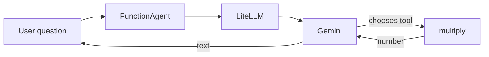

# Phase 0 — Orientation

Last grounded: 2026-08-21  
Prereq files: `AGENTS.md`, `docs/00-setup.md`  
Fetch before writing:  
- https://docs.llamaindex.ai/en/stable/understanding/agent/  
- https://docs.llamaindex.ai/en/stable/integrations/llm/litellm/  
- https://docs.litellm.ai/docs/providers/gemini  
uv (from `agents/foundation`):

**Windows (PowerShell):**

```powershell
if (Test-Path agents\foundation) { cd agents\foundation }
uv sync
.venv\Scripts\activate
if (-not (Test-Path 00_orientation.py)) { New-Item -ItemType File 00_orientation.py }
```

**macOS/Linux:**

```bash
[ -d agents/foundation ] && cd agents/foundation
uv sync
source .venv/bin/activate
touch 00_orientation.py
```

Open `00_orientation.py` in your IDE — you will write the segments below there. The last line creates the file only if it does not already exist, so the same block is safe to re-run.

New terminals (VS Code, Cursor) usually open at the repo root; PyCharm sometimes restores already inside the folder. That `if` / `[ -d ... ] &&` does the right thing either way.

Suggested file: `agents/foundation/00_orientation.py`  
Mode: **abstraction**, ~20 lines, not graded.

## What you'll run

A LlamaIndex `FunctionAgent` with **one** tool, through LiteLLM → Gemini. The only thing to notice: the model *chose* to call your function.

## Why it matters

Everything later gets explained against something you've watched run, not a slide. Keep it to ~20 lines: no error handling, no RAG, no second tool.

**Not `AgentWorkflow`.** Official one-tool starter is `FunctionAgent`. `AgentWorkflow` is for multiple agents (Phase 7b).

Chat goes through **LiteLLM**, not the Google SDK. Swap providers later by changing the model string.

## Skeleton

An agent = **model + tools + a loop**.

1. Pick a model
2. Write one tool
3. Hand both to `FunctionAgent`
4. Ask a question
5. Print the answer

## Official docs

- Building an agent: https://docs.llamaindex.ai/en/stable/understanding/agent/
- LlamaIndex LiteLLM: https://docs.llamaindex.ai/en/stable/integrations/llm/litellm/
- LiteLLM Gemini: https://docs.litellm.ai/docs/providers/gemini

## The big picture

An agent is an LLM plus tools plus a loop: the model either answers or emits a structured call; your code runs the function; the result goes back; repeat until it answers. Here the framework owns the loop. Phase 2 will make you own it.



---

## Segment — one tool, live

`.env` must contain `GEMINI_API_KEY`.

```python
import asyncio
import os

from dotenv import load_dotenv
from llama_index.core.agent.workflow import FunctionAgent
from llama_index.llms.litellm import LiteLLM

load_dotenv()


def multiply(a: float, b: float) -> float:
    """Multiply two numbers and return the product."""
    return a * b


agent = FunctionAgent(
    tools=[multiply],
    llm=LiteLLM(model=os.environ.get("GEMINI_MODEL", "gemini/gemini-2.5-flash")),
    system_prompt="You are an assistant that uses tools for arithmetic.",
)


async def main() -> None:
    response = await agent.run("What is 1234 * 4567?")
    print(str(response))


if __name__ == "__main__":
    asyncio.run(main())
```

```powershell
uv run python 00_orientation.py
```

**Expected:** a sentence containing `5635678` (or the product). The model should have used `multiply`, not mental math — the system prompt asks it to.

**What just moved:**

1. Question + tool schema (name, docstring, types) went to the model.
2. Model selected `multiply` and filled `a` / `b`.
3. Your function ran.
4. Result went back; model wrote the final sentence.

**Common failures**

| Symptom | Fix |
|---|---|
| `OPENAI_API_KEY` / auth error | You imported a default OpenAI LLM. This script must use `LiteLLM(...)`. |
| Gemini 401 | `.env` missing or `load_dotenv()` not called. |
| Answers without calling the tool | Tighten the prompt: `"Use the multiply tool. What is 1234 * 4567?"` |
| `asyncio` error in notebook vs script | Script needs `asyncio.run`. Notebooks can `await` at top level. |

Do not add chat history, RAG, or a second tool here.

## Checkpoint

1. What three things did the model see besides the user question?
2. Who executed `multiply` — the model or your process?
3. Why not `AgentWorkflow` in this phase?

Answers: (1) tool name, docstring, argument types; (2) your process; (3) `FunctionAgent` is the one-tool starter; `AgentWorkflow` is multi-agent.
