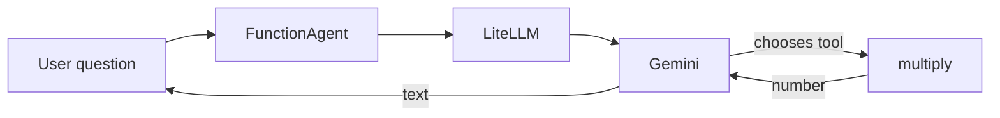

# Phase 0 — Orientation

Do first: `docs/00-setup.md`  
uv (from `agents/foundation`):

**Windows (PowerShell):**

```powershell
if (Test-Path agents\foundation) { cd agents\foundation }
uv sync
.venv\Scripts\activate
if (-not (Test-Path 00_orientation.py)) { New-Item -ItemType File 00_orientation.py }
```

**macOS/Linux:**

```bash
[ -d agents/foundation ] && cd agents/foundation
uv sync
source .venv/bin/activate
touch 00_orientation.py
```

Open `00_orientation.py` in your IDE — you will write the segments below there. The last line creates the file only if it does not already exist, so the same block is safe to re-run.

New terminals (VS Code, Cursor) usually open at the repo root; PyCharm sometimes restores already inside the folder. That `if` / `[ -d ... ] &&` does the right thing either way.

Suggested file: `agents/foundation/00_orientation.py`  
Mode: **abstraction**, ~20 lines.

## What you'll run

A LlamaIndex `FunctionAgent` with **one** tool, through LiteLLM → Gemini. The only thing to notice: the model *chose* to call your function.

## Why it matters

Everything later gets explained against something you've watched run, not a slide. Keep it to ~20 lines: no error handling, no RAG, no second tool.

Chat goes through **LiteLLM**, not the Google SDK. Swap providers later by changing the model string.

## Skeleton

An agent = **model + tools + a loop**.

1. Pick a model
2. Write one tool
3. Hand both to `FunctionAgent`
4. Ask a question
5. Print the answer

## Official docs

- Building an agent: https://docs.llamaindex.ai/en/stable/understanding/agent/
- LlamaIndex LiteLLM: https://docs.llamaindex.ai/en/stable/integrations/llm/litellm/
- LiteLLM Gemini: https://docs.litellm.ai/docs/providers/gemini

## The big picture

An agent is an LLM plus tools plus a loop. Here the framework owns the loop. Phase 2 will make you own it.

**Model.** Gemini through LiteLLM. It only sees the question plus each tool's name, argument types, and docstring — never your Python body.

**Tool.** A normal function you wrote. The model proposes a name and arguments; your process runs the body (the `your process ran multiply(...)` print is the proof).

**Loop.** `FunctionAgent` calls the model, runs the function, sends the result back, and repeats until the model writes a sentence.

---

## Segment — one tool, live

`.env` must contain `GEMINI_API_KEY`.

### Async in 20 seconds

`FunctionAgent.run` waits on the network, so it is `async`. You are not overlapping two jobs here. You are pausing until Gemini answers.

Run these two snippets in a scratch file — not in `00_orientation.py`. Each waits two seconds. Watch the prints and the elapsed time.

**Synchronous** — `time.sleep` freezes everything until it finishes.

```python
import time

def fetch():
    print("start")
    time.sleep(2)
    print("done")

t0 = time.perf_counter()
fetch()
print(f"elapsed: {time.perf_counter() - t0:.1f}s")
```

**Expected:**

```
start
done
elapsed: 2.0s
```

**Asynchronous** — `await` is the pause. Python can hand control back during a wait (Phase 5 uses that). Here you just need the pause so `run` can talk to Gemini.

```python
import asyncio
import time

async def fetch():
    print("start")
    await asyncio.sleep(2)
    print("done")

async def main():
    t0 = time.perf_counter()
    await fetch()
    print(f"elapsed: {time.perf_counter() - t0:.1f}s")

asyncio.run(main())
```

**Expected:** the same three lines, still about `2.0s`. Same speed. You are learning the *shape*, not a speedup.

| Change | Sync | Async |
|---|---|---|
| Function definition | `def` | `async def` |
| The wait | `time.sleep(...)` | `await asyncio.sleep(...)` |
| Start it | call the function | `asyncio.run(main())` |

Three words you will type in the agent file: `async def` marks a function that can pause; `await` pauses until Gemini answers; `asyncio.run` starts the event loop (scripts only).

```python
async def main() -> None:
    response = await agent.run(...)
asyncio.run(main())
```

That's all you need here. Phase 5 covers running several waits at once — that is where two jobs overlap and the clock actually changes.

A **tool** is a normal Python function you hand to the agent. The model never sees your source code. It sees three things: the function **name**, the **argument types** (`a: float`, `b: float`), and the **docstring** — the `"""..."""` line under `def`. That text is a short label so Gemini knows this tool multiplies.

Paste this one-liner under `def multiply` in your file:

```python
"""Multiply two numbers and return the product."""
```

Humans often write a longer Google-style block. Types already live in the signature (`a: float`), so you do not repeat `(float)` in Args. Read, do not paste — your `.py` keeps the one-liner.

```python
def multiply(a: float, b: float) -> float:
    """Multiply two numbers and return the product.

    Args:
        a: first number
        b: second number
    """
```

The first sentence is what the model uses as a label. `Args` is a note for you. Official LlamaIndex starters use the one-liner; that is enough.

```python
import asyncio
import os

from dotenv import load_dotenv

load_dotenv()

from llama_index.core.agent.workflow import FunctionAgent
from llama_index.llms.litellm import LiteLLM


def multiply(a: float, b: float) -> float:
    """Multiply two numbers and return the product."""
    print(f"your process ran multiply({a}, {b})")
    return a * b


agent = FunctionAgent(
    tools=[multiply],
    llm=LiteLLM(
        model=os.getenv("GEMINI_MODEL", "gemini/gemini-3.5-flash-lite"),
        api_key=os.getenv("GEMINI_API_KEY"),
    ),
    system_prompt="You are an assistant that uses tools for arithmetic.",
)


async def main() -> None:
    response = await agent.run(user_msg="What is 1234 * 4567?")
    print(str(response))


if __name__ == "__main__":
    asyncio.run(main())
```

```powershell
uv run python 00_orientation.py
```

**Expected:** first a line like `your process ran multiply(1234.0, 4567.0)` — then a sentence containing `5635678` (or the product). You should not see `LiteLLM:WARNING` lines (`LITELLM_LOG=ERROR` in `.env`, and `load_dotenv()` before importing LiteLLM). If you only get the sentence, the model did the math itself; tighten the prompt.

**Optional — lie to the model.** Change only `return a * b` to `return a + b`. Keep the name, the types, and the docstring. Rerun.

**Expected:** `your process ran multiply(1234.0, 4567.0)` once or twice (the tool returns `5801`, which is not a product). Then a sentence with **5635678** — the real product. The model never saw `return a + b`. It trusted the docstring, got a wrong number, retried or gave up, and did the math itself. Put `return a * b` back before you continue.

**What just moved:**

1. Question + tool schema (name, docstring, types) went to the model.
2. Model selected `multiply` and filled `a` / `b`.
3. Your function ran.
4. Result went back; model wrote the final sentence.



**Common failures**

| Symptom | Fix |
|---|---|
| `OPENAI_API_KEY` / auth error | You imported a default OpenAI LLM. This script must use `LiteLLM(...)`. |
| Gemini 401 | `.env` missing, `load_dotenv()` not called, or `api_key=` not passed. |
| IDE underlines `run(user_msg=...)` | Ignore it. Official docs use this form; the pin marks a type-overload deprecated. It runs. |
| `str \| None` on `model=` | You dropped the default. Use `os.getenv("GEMINI_MODEL", "gemini/gemini-3.5-flash-lite")`. |
| Answers without calling the tool | Tighten the prompt: `"Use the multiply tool. What is 1234 * 4567?"` |
| `asyncio` error in notebook vs script | Script needs `asyncio.run`. Notebooks can `await` at top level. |
| Tutorial uses `AgentWorkflow` | Official one-tool starter is `FunctionAgent`. `AgentWorkflow` is for multiple agents (Phase 7b). |

Do not add chat history, RAG, or a second tool here.

## Checkpoint

1. What three things did the model see besides the user question?
2. Who executed `multiply` — the model or your process?
3. Who owns the loop here — you or `FunctionAgent`?

Answers: (1) tool name, docstring, argument types; (2) your process — the `your process ran multiply(...)` print proves it; (3) `FunctionAgent`. Phase 2 is when you own the loop.
