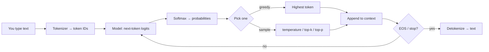

# Phase 1 — How decoding actually works

Do first: `docs/01-phase-0-orientation.md`  
uv: none required (HF Spaces are the demo)  
Suggested file: none  
Mode: **concept-only**. No neural nets. No training. No architecture diagrams.

## What you'll see

The machine view of Phase 0: you type text, the model predicts **one next token at a time**, then stops.

## Why it matters

Phase 0 looked like a decision. It was next-token prediction, steered toward a tool schema. If that click happens now, every later framework is the same loop with nicer syntax.

## Skeleton

A model only **picks the next token**.

1. Tokenize
2. Score every vocab item
3. Pick one (greedy or sample)
4. Append
5. Repeat until stop
6. Detokenize

## Official docs and demos

- HF Agents Course — What are LLMs: https://huggingface.co/learn/agents-course/unit1/what-are-llms  
- Tokenizer playground: https://huggingface.co/spaces/Xenova/the-tokenizer-playground  
- Dummy agent (ReAct hallucination): https://huggingface.co/learn/agents-course/unit1/dummy-agent-library  

Open the tokenizer Space and the course page (embedded decoding demo) **before** reading further. Type `The capital of France is` and watch tokens, not words.

---

## Segment 1 — What happens when you type

A token is a chunk of text the model knows (often a subword: `"interest"` + `"ing"` → `"interesting"`). English has ~600k words; a model vocab is often ~32k–128k tokens.

1. **Tokenize** the prompt into IDs.  
2. Model scores every vocab item (**logits**).  
3. **Softmax** turns scores into a probability distribution.  
4. **Pick** one token (greedy = argmax; otherwise sample).  
5. **Append** that token to the context. Repeat.  
6. Stop at an end-of-sequence token (or `max_tokens` / a `stop` string).  
7. **Detokenize** IDs back to text.

The model is **autoregressive**: each output becomes the next input. It does not “look up France” as a fact store in this picture — it continues the sequence that usually follows those tokens.

Chat APIs wrap this in **roles**. `system` / `user` / `assistant` become special tokens via a **chat template**. You send messages; the server templates them. Different models use different EOS tokens (`<|eot_id|>`, `<|im_end|>`, …). You do not memorize them; you do not bypass the chat API unless you mean to.

---

## Segment 2 — How picking changes the voice

Same distribution, different picker.

| Strategy | What it does | Character |
|---|---|---|
| Greedy | Always the top token | Dry, repetitive, often “correct” |
| Temperature | Sharpens (`<1`) or flattens (`>1`) the distribution | Low = safer; high = wilder |
| Top-k | Keep only the k most likely, then sample | Caps nonsense |
| Top-p (nucleus) | Keep the smallest set whose mass ≥ p | Caps nonsense by probability mass |

You do not implement these. You set them on the API (`temperature`, `top_p`, …). For tool-calling, **low temperature** is the usual default: you want the schema, not poetry.

---

## Segment 3 — Tool-calling is the same loop

Phase 0 did not grow a separate “reasoner.” The next-token process was aimed at tokens that look like a function call. Messages plus tool schemas go through the same decode loop. Prose tokens become assistant text. Tokens that look like a tool call make *your* code run the function, append the result as a tool message, and continue.

Two ways the industry steers that:

| Paradigm | How the model “calls” | Failure mode |
|---|---|---|
| **Prompted ReAct** | System prompt: Thought / Action / Observation as text | Model **hallucinates** `Observation:` instead of waiting for you. HF dummy agent stops at `stop=["Observation:"]` so *you* run the function. |
| **Native tool-calling** | API `tools=` schema; model returns `tool_calls` (Chat Completions) | Malformed JSON / skipped call on small local models. Phase 2. |

Phase 0 used native tool-calling inside `FunctionAgent`. Phase 2 will write that loop by hand.

---

## Try it in the browser

Play with the tokenizer Space and the course page's decoder — don't build anything. Hosted Gemini won't show you raw next-token logits; you don't need them yet.

## What not to do

- Implement softmax, attention, or training.
- Treat greedy as “the model thinks.”
- Skip the tokenizer Space.

## Checkpoint

1. What is a token, if not always a word?
2. When does the loop stop?
3. Why does prompted ReAct need `stop=["Observation:"]`?
4. Is tool-calling a different algorithm from chatting?

Answers: (1) a vocab piece, often subword; (2) EOS / stop / max tokens; (3) otherwise the model fabricates the observation; (4) no — same next-token loop, different target shape.
