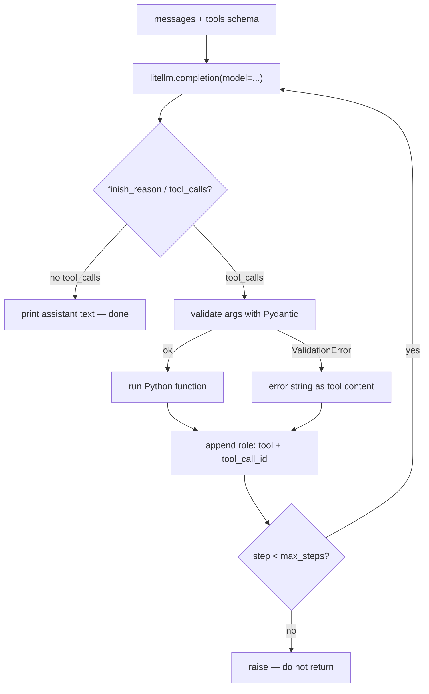

# Phase 2 — The raw tool-calling loop

Last grounded: 2026-08-21  
Prereq files: `docs/00-setup.md`, `docs/01-phase-0-orientation.md`, `docs/02-phase-1-decoding.md`  
Fetch before writing:  
- https://docs.litellm.ai/docs/  
- https://docs.litellm.ai/docs/providers/gemini  
- https://platform.openai.com/docs/guides/function-calling  
- https://docs.anthropic.com/en/docs/agents-and-tools/tool-use/overview  
- https://docs.pydantic.dev/latest/concepts/models/  
- https://huggingface.co/learn/agents-course/unit1/dummy-agent-library  
uv (from `agents/foundation`):

```powershell
cd agents\foundation
uv venv
uv pip install -r requirements.txt
```

Suggested file: `agents/foundation/02_tool_loop.py`  
Mode: **raw-first**. This is the load-bearing phase. Keep the loop small enough to hold in your head. No streaming, no retries, no multi-agent.

## What

Hand-write: messages + tool schemas → `litellm.completion` proposes a call → your code runs it → result goes back as `role: "tool"` → repeat, with `max_steps` that **raises**.

## Why

Every later framework (LlamaIndex `FunctionAgent`, LangGraph `ToolNode`) is this loop. If you skip it, those APIs stay magic.

**API: Chat Completions shape**, not the Responses API. Official OpenAI docs now lead with Responses (`function_call` / `function_call_output`). LiteLLM returns the Chat Completions object (`choices[0].message.tool_calls`). Responses is Phase 9.

**Provider:** Gemini via LiteLLM. Swap later by changing `MODEL` only.

```python
MODEL = "gemini/gemini-2.5-flash"
# MODEL = "openai/gpt-4o-mini"
# MODEL = "ollama/qwen3"  # needs Ollama running
```

## Skeleton

The loop = **messages + schemas → call → run → append → repeat**.

1. Messages in
2. `completion(..., tools=)`
3. If `tool_calls`: validate, run, append `role: "tool"`
4. Else: print answer and stop
5. `max_steps` exceeded → raise

## Official sources

- LiteLLM: https://docs.litellm.ai/docs/
- LiteLLM Gemini: https://docs.litellm.ai/docs/providers/gemini
- OpenAI function calling (shape reference): https://platform.openai.com/docs/guides/function-calling
- Anthropic tool use (contrast only): https://docs.anthropic.com/en/docs/agents-and-tools/tool-use/overview
- Pydantic models: https://docs.pydantic.dev/latest/concepts/models/



---

## Segment 1 — Bare chat (no tools)

```python
import os
from dotenv import load_dotenv
from litellm import completion

load_dotenv()

MODEL = os.environ.get("GEMINI_MODEL", "gemini/gemini-2.5-flash")

resp = completion(
    model=MODEL,
    messages=[{"role": "user", "content": "Say hi in five words."}],
)
print(resp.choices[0].message.content)
```

```powershell
uv run python 02_tool_loop.py
```

**Expected:** a short greeting. 401 → `.env` / `load_dotenv()`.

---

## Segment 2 — Write the schema by hand first

Do this **on paper or in a comment** before any Pydantic `model_json_schema()`. Chat Completions nests `function`:

```json
{
  "type": "function",
  "function": {
    "name": "add",
    "description": "Add two numbers and return the sum.",
    "parameters": {
      "type": "object",
      "properties": {
        "a": {"type": "number", "description": "First addend"},
        "b": {"type": "number", "description": "Second addend"}
      },
      "required": ["a", "b"]
    }
  }
}
```

That shape **is** the tool. Descriptions are how the model decides *when* to call it.

Optional second tool (stub is fine):

```json
{
  "type": "function",
  "function": {
    "name": "get_weather",
    "description": "Get a fake weather string for a city. Use when the user asks about weather.",
    "parameters": {
      "type": "object",
      "properties": {
        "city": {"type": "string", "description": "City name, e.g. Paris"}
      },
      "required": ["city"]
    }
  }
}
```

---

## Segment 3 — Send `tools=` and read `tool_calls`

```python
TOOLS = [
    {
        "type": "function",
        "function": {
            "name": "add",
            "description": "Add two numbers and return the sum.",
            "parameters": {
                "type": "object",
                "properties": {
                    "a": {"type": "number", "description": "First addend"},
                    "b": {"type": "number", "description": "Second addend"},
                },
                "required": ["a", "b"],
            },
        },
    }
]

messages = [
    {"role": "system", "content": "Use tools for arithmetic. Do not compute yourself."},
    {"role": "user", "content": "What is 41 + 1?"},
]
resp = completion(model=MODEL, messages=messages, tools=TOOLS)
msg = resp.choices[0].message
print("finish_reason:", resp.choices[0].finish_reason)
print("content:", msg.content)
print("tool_calls:", msg.tool_calls)
```

**Expected:** `finish_reason` is often `"tool_calls"`. `msg.tool_calls` is a list. Each item has `id`, and `function.name` / `function.arguments` (arguments are a **JSON string**).

If `tool_calls` is empty: tighten the system prompt, or try `tool_choice="required"`.

---

## Segment 4 — Execute, append, loop

Chat Completions result shape (not Responses):

- Assistant turn carries `tool_calls`.
- You append that assistant message (or a dict with `role`, `content`, `tool_calls`).
- Each result is a **separate** message: `role: "tool"`, keyed by `tool_call_id`.

```python
import json


def add(a: float, b: float) -> float:
    return a + b


FUNCTIONS = {"add": add}

messages.append(msg)
for call in msg.tool_calls or []:
    args = json.loads(call.function.arguments)
    result = FUNCTIONS[call.function.name](**args)
    messages.append(
        {
            "role": "tool",
            "tool_call_id": call.id,
            "content": str(result),
        }
    )

resp2 = completion(model=MODEL, messages=messages, tools=TOOLS)
print(resp2.choices[0].message.content)
```

**Expected:** a sentence that includes `42`.

That is the whole agent. Wrap it in `while` next.

---

## Segment 5 — Pydantic validates args; errors go **back to the model**

Do not crash the loop on bad JSON. The observation *is* the error string.

```python
from pydantic import BaseModel, ValidationError


class AddArgs(BaseModel):
    a: float
    b: float


def run_add(raw_json: str) -> str:
    try:
        args = AddArgs.model_validate_json(raw_json)
    except ValidationError as exc:
        return f"Invalid arguments: {exc}"
    return str(add(args.a, args.b))
```

Use `run_add(call.function.arguments)` instead of `json.loads` + `**`. Generate schema from Pydantic **only after** you wrote JSON by hand once.

---

## Segment 6 — `max_steps` raises

A silent `return` teaches the wrong lesson. Runaway loops are a failure.

```python
MAX_STEPS = 8


def run_agent(user_text: str) -> str:
    messages = [
        {"role": "system", "content": "Use tools for arithmetic. Do not compute yourself."},
        {"role": "user", "content": user_text},
    ]
    for step in range(MAX_STEPS):
        resp = completion(model=MODEL, messages=messages, tools=TOOLS)
        msg = resp.choices[0].message
        messages.append(msg)
        if not msg.tool_calls:
            return msg.content or ""
        for call in msg.tool_calls:
            if call.function.name == "add":
                content = run_add(call.function.arguments)
            else:
                content = f"Unknown tool: {call.function.name}"
            messages.append(
                {"role": "tool", "tool_call_id": call.id, "content": content}
            )
    raise RuntimeError(f"Agent exceeded max_steps={MAX_STEPS}")


if __name__ == "__main__":
    print(run_agent("What is 41 + 1?"))
```

**Expected:** `42` in the printed answer. To test the guard, temporarily set `MAX_STEPS = 1` and a prompt that forces a tool call — you should get `RuntimeError`, not a partial answer.

---

## Segment 7 — Anthropic shape (read, do not implement)

OpenAI Chat Completions and Anthropic are **not** interchangeable. LiteLLM hides this when you call Anthropic through `completion()`. Feel the difference once anyway:

| | OpenAI / LiteLLM Chat Completions | Anthropic native |
|---|---|---|
| Model wants a tool | `assistant.tool_calls[]` | `content` block `type: "tool_use"` |
| You return the result | **new message** `role: "tool"` + `tool_call_id` | **inside the next `user` turn**, block `type: "tool_result"` + `tool_use_id` |

---

## Engineer extras (short)

**Hot-swap.** Change `MODEL`. Set the matching env key (`OPENAI_API_KEY`, or Ollama `api_base`). The loop stays.

**Parallel calls.** One assistant message may contain two `tool_calls`. Loop them all, append one `role: "tool"` per `id`, then call once.

**`tool_choice`.** `"auto"` (default), `"required"`, `"none"`.

**`finish_reason`.** `"stop"` = done. `"tool_calls"` = you have work. `"length"` = token cap.

Do not add streaming or retries in this file. Do not start the LiteLLM proxy.

---

## Suggested final file shape

`agents/foundation/02_tool_loop.py` — `MODEL`, `TOOLS`, `AddArgs`, `run_add`, `run_agent`, `if __name__`. Roughly 60–80 lines.

## Checkpoint

1. Why is `function.arguments` a string?
2. What message `role` carries the tool result?
3. What should happen when Pydantic rejects args?
4. Why raise on `max_steps` instead of returning?
5. What do you change to use OpenAI instead of Gemini?

Answers: (1) the model emitted tokens, not a Python dict; (2) `"tool"`; (3) send the error string back as `content`; (4) runaway is a real failure; (5) `MODEL` and `OPENAI_API_KEY`.

---

## Try this

Keep the loop. Keep `add`. Invent **one** more tool you would actually use — a `now()` clock, a fake weather lookup, a `remember(key, value)` stub, anything — write its JSON schema by hand like Segment 2, then give it one user line that needs **both** tools ("add 12 + 30 and remember that I owe 42").

Done when you see both `role: "tool"` messages in the transcript and a final answer using both results. Skip it or invent something else entirely — that is the point.
