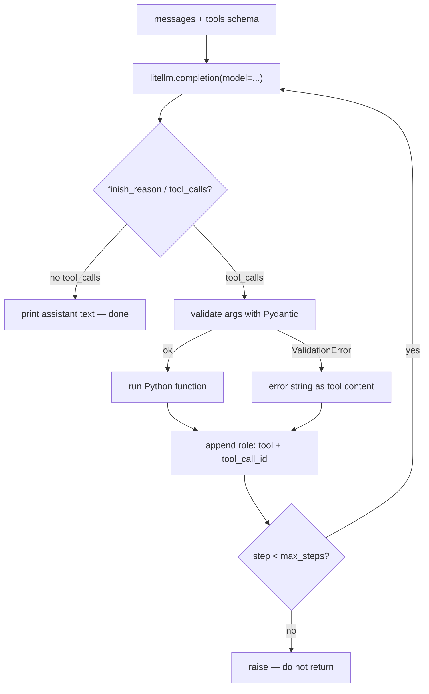

# Phase 2 — The raw tool-calling loop

Do first: `docs/00-setup.md`, `docs/01-phase-0-orientation.md`, `docs/02-phase-1-decoding.md`  
uv (from `agents/foundation`):

**Windows (PowerShell):**

```powershell
if (Test-Path agents\foundation) { cd agents\foundation }
uv sync
.venv\Scripts\activate
if (-not (Test-Path 02_tool_loop.py)) { New-Item -ItemType File 02_tool_loop.py }
```

**macOS/Linux:**

```bash
[ -d agents/foundation ] && cd agents/foundation
uv sync
source .venv/bin/activate
touch 02_tool_loop.py
```

Open `02_tool_loop.py` in your IDE — you will write the segments below there. The last line creates the file only if it does not already exist, so the same block is safe to re-run.

New terminals (VS Code, Cursor) usually open at the repo root; PyCharm sometimes restores already inside the folder. That `if` / `[ -d ... ] &&` does the right thing either way.

Suggested file: `agents/foundation/02_tool_loop.py`  
Mode: **raw-first**. This is the phase every later framework explanation rests on. Keep the loop small enough to hold in your head. No streaming, no retries, no multi-agent.

## What you'll build

Hand-write: messages + tool schemas → `litellm.completion` proposes a call → your code runs it → result goes back as `role: "tool"` → repeat, with `max_steps` that **raises**.

## Why it matters

Every later framework (LlamaIndex `FunctionAgent`, LangGraph `ToolNode`) is this loop. Skip it and those APIs stay magic forever.

**API: Chat Completions shape**, not the Responses API. Official OpenAI docs now lead with Responses (`function_call` / `function_call_output`). LiteLLM returns the Chat Completions object (`choices[0].message.tool_calls`). Responses is Phase 9.

**Provider:** Gemini via LiteLLM. Swap later by changing `MODEL` only.

```python
MODEL = "gemini/gemini-3.5-flash-lite"
```

Swap later by changing `MODEL` only — `openai/gpt-4o-mini`, or `ollama/qwen3` if Ollama is running.

## Skeleton

The loop = **messages + schemas → call → run → append → repeat**.

1. Messages in
2. `completion(..., tools=)`
3. If `tool_calls`: validate, run, append `role: "tool"`
4. Else: print answer and stop
5. `max_steps` exceeded → raise

## Official docs

- LiteLLM: https://docs.litellm.ai/docs/
- LiteLLM Gemini: https://docs.litellm.ai/docs/providers/gemini
- OpenAI function calling (shape reference): https://platform.openai.com/docs/guides/function-calling
- Anthropic tool use (contrast only): https://docs.anthropic.com/en/docs/agents-and-tools/tool-use/overview
- Pydantic models: https://docs.pydantic.dev/latest/concepts/models/

## The big picture

The model never sees your Python. It sees messages plus JSON schemas, proposes a call, and you run the function.

**Messages.** The only context the model has. User text, system text, and later tool results all live on this list.

**Schemas (`TOOLS`).** JSON the model reads: name, description, argument types. Same job as Phase 0's docstring. OpenAI's function-calling flow is the same five beats: send tools, receive a call, run your code, send the output back, get a sentence (or another call).

**Proposal.** `completion(..., tools=)` returns a sentence, or `tool_calls` with a name and a JSON-args string.

**Run.** Your `if` on the name executes the Python. Pydantic checks the args; a bad payload becomes an error string, not a crash.

**Append.** A `role: "tool"` message with the same `tool_call_id` puts the result on the list so the next `completion` can see it.

**Stop.** No `tool_calls` → that text is the answer. Hitting `max_steps` raises — a runaway loop is a failure.

---

## Segment 1 — Bare chat (no tools)

```python
import os
from dotenv import load_dotenv

load_dotenv()

from litellm import completion

MODEL = os.getenv("GEMINI_MODEL", "gemini/gemini-3.5-flash-lite")
API_KEY = os.getenv("GEMINI_API_KEY")

resp = completion(
    model=MODEL,
    api_key=API_KEY,
    messages=[{"role": "user", "content": "Say hi in five words."}],
)
print(resp.choices[0].message.content)
```

```powershell
uv run python 02_tool_loop.py
```

**Expected:** a short greeting. 401 → `.env` / `load_dotenv()`.

Keep `MODEL`, `API_KEY`, and the imports. The next segments replace the `completion` + `print` in this same file.

---

## Segment 2 — Write the schema by hand first

Look at this JSON. You will paste it as `TOOLS` in the next segment. Do not generate it from Pydantic yet.

Chat Completions nests `function`:

```json
{
  "type": "function",
  "function": {
    "name": "add",
    "description": "Add two numbers and return the sum.",
    "parameters": {
      "type": "object",
      "properties": {
        "a": {"type": "number", "description": "First addend"},
        "b": {"type": "number", "description": "Second addend"}
      },
      "required": ["a", "b"]
    }
  }
}
```

That JSON **is** the tool, as far as the model is concerned. It never sees your Python. It sees `name`, argument types, and `description` — the same job as the Phase 0 **docstring**. A short label is enough: this tool adds. You do not need to explain arithmetic.

---

## Segment 3 — Send `tools=` and read `tool_calls`

Paste the JSON as `TOOLS`. Replace Segment 1's `completion` + `print` with this:

```python
TOOLS = [
    {
        "type": "function",
        "function": {
            "name": "add",
            "description": "Add two numbers and return the sum.",
            "parameters": {
                "type": "object",
                "properties": {
                    "a": {"type": "number", "description": "First addend"},
                    "b": {"type": "number", "description": "Second addend"},
                },
                "required": ["a", "b"],
            },
        },
    }
]

messages = [
    {"role": "system", "content": "Use tools for arithmetic. Do not compute yourself."},
    {"role": "user", "content": "What is 41 + 1?"},
]
resp = completion(
    model=MODEL,
    api_key=API_KEY,
    messages=messages,
    tools=TOOLS,
)
msg = resp.choices[0].message
print("finish_reason:", resp.choices[0].finish_reason)
print("content:", msg.content)
print("tool_calls:", msg.tool_calls)
```

**Expected:** `finish_reason` is often `"tool_calls"`. `content` is `None` (or empty). `tool_calls` is a list. Each item has `id`, and `function.name` / `function.arguments` (arguments are a **JSON string**).

If `tool_calls` is empty: tighten the system prompt, or try `tool_choice="required"`.

Do not `print(resp)` or `print(msg)`. The object is huge (Gemini extras, `thought_signature`, usage). You only need this path:

```
resp.choices[0].finish_reason              → "tool_calls" or "stop"
resp.choices[0].message                    → msg
  msg.content                              → None while it is calling a tool
  msg.tool_calls[0].function.name          → "add"
  msg.tool_calls[0].function.arguments     → '{"a": 41, "b": 1}'  (a string)
  msg.tool_calls[0].id                     → you send this back as tool_call_id
```

**What just moved:** the model did not add 41 and 1. It proposed a call. Your Python has not run yet.

---

## Segment 4 — Execute, append, call again

Keep `TOOLS` and `messages`. Under them, add the Python function and feed the result back.

Chat Completions result shape (not Responses):

- Assistant turn carries `tool_calls`.
- You append that assistant message.
- Each result is a **separate** message: `role: "tool"`, keyed by `tool_call_id`.

```python
import json


def add(a: float, b: float) -> float:
    print(f"your process ran add({a}, {b})")
    return a + b


messages.append(msg)
for call in msg.tool_calls or []:
    if call.function.name == "add":
        args = json.loads(call.function.arguments)
        content = str(add(**args))
    else:
        content = f"Unknown tool: {call.function.name}"
    messages.append(
        {
            "role": "tool",
            "tool_call_id": call.id,
            "content": content,
        }
    )

resp2 = completion(
    model=MODEL,
    api_key=API_KEY,
    messages=messages,
    tools=TOOLS,
)
print(resp2.choices[0].message.content)
```

**Expected:** first `your process ran add(41.0, 1.0)` (or `41` / `1` without `.0`) — then a sentence that includes `42`.

That print is the same proof as Phase 0: your process ran, not the model.

**What just moved:**

1. You stored the assistant's proposal on `messages`.
2. You ran `add` and appended `role: "tool"` with the same `id`.
3. The second `completion` saw that number and wrote the sentence.

That is the whole agent. Wrap it in a loop next.

---

## Segment 5 — Pydantic validates args; errors go **back to the model**

Do not crash the loop on bad JSON. The observation *is* the error string.

### Pydantic in 20 seconds

The model sends arguments as a JSON string, not a Python dict. `json.loads` crashes on junk. Pydantic turns that string into typed fields, or gives you an error to send back.

Run this in a scratch file — not in `02_tool_loop.py`. You need this because a bad tool payload must not kill the loop.

```python
from pydantic import BaseModel, ValidationError


class AddArgs(BaseModel):
    a: float
    b: float


def run_add(raw_json: str) -> str:
    try:
        args = AddArgs.model_validate_json(raw_json)
    except ValidationError as exc:
        return f"Invalid arguments: {exc}"
    return str(args.a + args.b)


print(run_add('{"a": 1, "b": 2}'))
print(run_add("nope"))
```

**Expected:** first line `3.0`. Second line starts with `Invalid arguments:` and names the JSON problem. The process did not crash.

| Change | `json.loads` | Pydantic |
|---|---|---|
| Parse | dict or crash | `AddArgs` or `ValidationError` |
| Types | you hope | `a` and `b` are floats |
| Bad input | your process dies | error string you can send back as `role: "tool"` |

Forcing the *model's* JSON shape (structured output) is Phase 9. Here you only validate what the model already emitted.

```python
from pydantic import BaseModel, ValidationError


class AddArgs(BaseModel):
    a: float
    b: float


def run_add(raw_json: str) -> str:
    try:
        args = AddArgs.model_validate_json(raw_json)
    except ValidationError as exc:
        return f"Invalid arguments: {exc}"
    return str(add(args.a, args.b))
```

In the Segment 4 `for` loop, replace `json.loads` + `add(**args)` with `run_add(call.function.arguments)`. Generate schema from Pydantic **only after** you wrote JSON by hand once.

---

## Segment 6 — `max_steps` raises

A silent `return` teaches the wrong lesson. Runaway loops are a failure.

Replace the one-shot Segment 3–4 prints with this. Keep `TOOLS`, `add`, `AddArgs`, and `run_add`.

```python
MAX_STEPS = 8


def run_agent(user_text: str) -> str:
    messages = [
        {"role": "system", "content": "Use tools for arithmetic. Do not compute yourself."},
        {"role": "user", "content": user_text},
    ]
    for step in range(MAX_STEPS):
        resp = completion(
            model=MODEL,
            api_key=API_KEY,
            messages=messages,
            tools=TOOLS,
        )
        msg = resp.choices[0].message
        messages.append(msg)
        if not msg.tool_calls:
            return msg.content or ""
        for call in msg.tool_calls:
            if call.function.name == "add":
                content = run_add(call.function.arguments)
            else:
                content = f"Unknown tool: {call.function.name}"
            messages.append(
                {"role": "tool", "tool_call_id": call.id, "content": content}
            )
    raise RuntimeError(f"Agent exceeded max_steps={MAX_STEPS}")


if __name__ == "__main__":
    print(run_agent("What is 41 + 1?"))
```

**Expected:** `your process ran add(...)` then `42` in the printed answer. To test the guard, temporarily set `MAX_STEPS = 1` and a prompt that forces a tool call — you should get `RuntimeError`, not a partial answer.

**What just moved:**

1. Same `messages` list as Segment 3, now inside a function.
2. Each `for` step is one `completion`.
3. Append the assistant message **first** — the next call must see the `tool_calls` it proposed.
4. No `tool_calls` → that text is the answer. Return it.
5. Else run `run_add` (or `"Unknown tool"`).
6. Append `role: "tool"` with the same `id`. The next step the model sees the number.
7. If the `for` ends without returning: raise. Do not return a half-answer.



---

## Segment 7 — Anthropic shape (read, do not implement)

OpenAI Chat Completions and Anthropic are **not** interchangeable. LiteLLM hides this when you call Anthropic through `completion()`. Feel the difference once anyway:

| | OpenAI / LiteLLM Chat Completions | Anthropic native |
|---|---|---|
| Model wants a tool | `assistant.tool_calls[]` | `content` block `type: "tool_use"` |
| You return the result | **new message** `role: "tool"` + `tool_call_id` | **inside the next `user` turn**, block `type: "tool_result"` + `tool_use_id` |

---

## Worth knowing

**Hot-swap.** Change `MODEL`. Set the matching env key (`OPENAI_API_KEY`, or Ollama `api_base`). The loop stays.

**Parallel calls.** One assistant message may contain two `tool_calls`. Loop them all, append one `role: "tool"` per `id`, then call once.

**`tool_choice`.** `"auto"` (default), `"required"`, `"none"`.

**`finish_reason`.** `"stop"` = done. `"tool_calls"` = you have work. `"length"` = token cap.

Do not add streaming or retries in this file. Do not start the LiteLLM proxy.

## Common failures

| Symptom | Cause / fix |
|---|---|
| Pydantic serializer warning on `tool_calls` | Harmless. Gemini extra fields on the LiteLLM `Message` you appended. The tool still ran. Pydantic has no env mute like `LITELLM_LOG` — ignore it. |
| Huge dump / `thought_signature` | You printed `resp` or `msg`. Print the three fields in Segment 3 instead. |
| Sentence with `42` but no `your process ran add(...)` | The model did the math itself. Tighten the system prompt. |
| `your process ran add(...)` twice, then a sentence with `42` anyway | The tool returned a number that did not match the description (e.g. you changed `a + b` to `a - b`). The model may retry the same call, then ignore the tool and compute itself. |

---

## Your finished file

`agents/foundation/02_tool_loop.py` — `MODEL`, `TOOLS`, `add` (with the process print), `AddArgs`, `run_add`, `run_agent`, `if __name__`. Roughly 60–80 lines. No `FUNCTIONS` dict — one `if` on the tool name is enough.

## Checkpoint

1. Why is `function.arguments` a string?
2. What message `role` carries the tool result?
3. What should happen when Pydantic rejects args?
4. Why raise on `max_steps` instead of returning?
5. What do you change to use OpenAI instead of Gemini?

Answers: (1) the model emitted tokens, not a Python dict; (2) `"tool"`; (3) send the error string back as `content`; (4) runaway is a real failure; (5) `MODEL` and `OPENAI_API_KEY`.

---

## Try this

Keep the loop. Keep `add`. Add **one** more tool — pick one of these, or invent your own — write its JSON schema by hand like Segment 2, then give it one user line that needs **both** tools.

Copy the schema the same way you copied `add`: `name`, a one-line `description`, `parameters`. Then a tiny Python function and one more `if` in the dispatch.

**`now()`** — no arguments. `description`: `"Return today's date and time."`

```python
from datetime import datetime


def now() -> str:
    print("your process ran now()")
    return datetime.now().isoformat(timespec="seconds")
```

**`dice(sides)`** — one number. `description`: `"Roll a die with this many sides."`

```python
import random


def dice(sides: int) -> int:
    print(f"your process ran dice({sides})")
    return random.randint(1, sides)
```

**`shout(text)`** — one string. `description`: `"Repeat the text in capital letters."`

```python
def shout(text: str) -> str:
    print(f"your process ran shout({text})")
    return text.upper()
```

Example user line if you pick `now`: `"What is 12 + 30, and what time is it?"`

Done when you see both `role: "tool"` messages and a final answer using both results. Skip it or invent something else entirely — that is the point. A tool is just a function plus a label. The model never sees the body.
