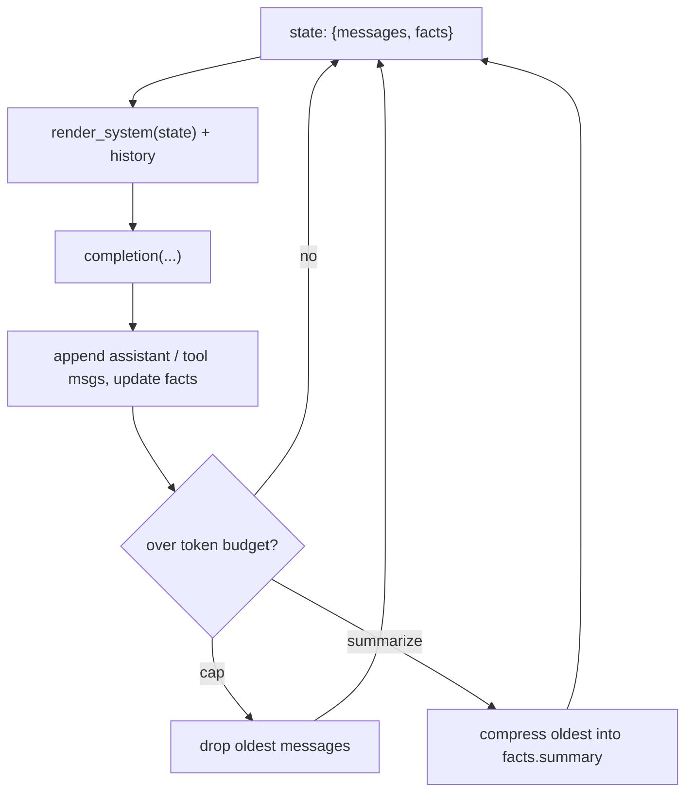

# Phase 3 — State and memory by hand

Last grounded: 2026-08-23  
Prereq files: `docs/00-setup.md`, `docs/02-phase-1-decoding.md`, `docs/03-phase-2-tool-loop.md`  
Fetch before writing:  
- https://docs.litellm.ai/docs/completion/token_usage  
- https://docs.litellm.ai/docs/providers/gemini  
- https://docs.langchain.com/oss/python/langgraph/graph-api (read the Reducers + `MessagesState` part only — foreshadow, do not import)  
uv (from `agents/foundation`):

**Windows (PowerShell):**

```powershell
if (Test-Path agents\foundation) { cd agents\foundation }
uv sync
.venv\Scripts\activate
if (-not (Test-Path 03_state.py)) { New-Item -ItemType File 03_state.py }
```

**macOS/Linux:**

```bash
[ -d agents/foundation ] && cd agents/foundation
uv sync
source .venv/bin/activate
touch 03_state.py
```

Open `03_state.py` in your IDE — you will write the segments below there. The last line creates the file only if it does not already exist, so the same block is safe to re-run.

New terminals (VS Code, Cursor) usually open at the repo root; PyCharm sometimes restores already inside the folder. That `if` / `[ -d ... ] &&` does the right thing either way.

No new packages. Same `pyproject.toml` as Phase 2.

Suggested file: `agents/foundation/03_state.py`  
Mode: **raw**. Direct extension of Phase 2. No Memory class, no framework.

## What you'll build

Make Phase 2's throwaway `messages` list into explicit **state**: conversation history plus a small facts dict, rendered into the system prompt on every turn — and kept under an artificial token budget with two strategies: **cap** (drop oldest) vs **summarize** (compress oldest).

## Why it matters

Phase 2's `run_agent` built `messages` inside the function. When it returned, everything the agent knew died. Real agents carry context across turns, and every framework memory feature (`ChatMemoryBuffer`, LangGraph checkpoints, whatever ships next year) reduces to the same thing: **data you hold yourself, rendered into the prompt**. Build it once by hand so those abstractions are legible later.

One thing to plant for later: LangGraph's `MessagesState` stores a message list whose reducer decides overwrite-vs-append on updates — exactly the choice you make by hand here when you decide whether new turns replace or extend `state["messages"]`. Phase 7 makes that explicit.

## Skeleton

Memory = **a dict you render into the prompt**.

1. Hold `state = {messages, facts}`
2. Render facts into the system string
3. Call the Phase 2 loop on that state
4. If over budget: cap or summarize

## Official docs

- LiteLLM token usage & helpers: https://docs.litellm.ai/docs/completion/token_usage
- LiteLLM Gemini provider: https://docs.litellm.ai/docs/providers/gemini
- LangGraph Graph API (reducers / `MessagesState`, foreshadow only): https://docs.langchain.com/oss/python/langgraph/graph-api

## The big picture

State = `{"messages": [...], "facts": {...}}`. History gives the model continuity of conversation; facts give it durability that survives trimming. The system prompt is a **rendering** of that state, rebuilt every call. Nothing else.



---

## Segment 1 — The messages list *is* state (and dies easily)

Two turns, one list:

```python
import os

from dotenv import load_dotenv
from litellm import completion

load_dotenv()

MODEL = os.getenv("GEMINI_MODEL", "gemini/gemini-3.5-flash-lite")
API_KEY = os.getenv("GEMINI_API_KEY")

messages = [{"role": "system", "content": "You are a concise assistant."}]

messages.append({"role": "user", "content": "My name is Ada."})
resp = completion(
    model=MODEL,
    api_key=API_KEY,
    messages=messages,
)
print(resp.choices[0].message.content)
messages.append(resp.choices[0].message)

messages.append({"role": "user", "content": "What is my name?"})
resp = completion(
    model=MODEL,
    api_key=API_KEY,
    messages=messages,
)
print(resp.choices[0].message.content)
```

```powershell
uv run python 03_state.py
```

**Expected:** the second answer contains `Ada`. Now delete the first three `append`/`completion` lines (keep only the final question) and rerun — the model has no idea. Nothing magical stored anything; **the list was the memory**, and you deleted it.

---

## Segment 2 — A TypedDict state + facts rendered into the system prompt

History alone is fragile (Segment 4 proves it). Add a second channel: facts the agent chooses to keep.

```python
from typing import TypedDict

from pydantic import BaseModel


class AgentState(TypedDict):
    messages: list           # chat turns (dicts or LiteLLM message objects)
    facts: dict[str, str]    # durable, survives trimming


class RememberArgs(BaseModel):
    key: str
    value: str


REMEMBER_TOOL = {
    "type": "function",
    "function": {
        "name": "remember",
        "description": "Store a fact that should survive the whole session.",
        "parameters": {
            "type": "object",
            "properties": {
                "key": {"type": "string", "description": "Short label, e.g. 'user_name'"},
                "value": {"type": "string", "description": "The fact itself"},
            },
            "required": ["key", "value"],
        },
    },
}


def render_system(state: AgentState) -> str:
    base = "You are a concise assistant. Use the remember tool for facts the user asks you to keep."
    if state["facts"]:
        lines = "\n".join(f"- {k}: {v}" for k, v in sorted(state["facts"].items()))
        base += f"\n\nKnown facts:\n{lines}"
    return base


def build_messages(state: AgentState) -> list:
    return [{"role": "system", "content": render_system(state)}] + state["messages"]
```

**Point:** the prompt is a pure function of state. Change `facts`, and the very next `completion()` sees different instructions. No object updated behind your back.

**Expected (quick check):**

```python
state: AgentState = {"messages": [], "facts": {}}
state["facts"]["user_name"] = "Ada"
for m in build_messages(state):
    print(m)
```

The system message now contains `Known facts:\n- user_name: Ada`.

---

## Segment 3 — Same loop as Phase 2, now operating on state

Copy `add`, `AddArgs`, its tool schema, and `run_add` from your `02_tool_loop.py`. Two changes: tools gain `remember`, and `run_agent` takes and mutates `state` instead of building `messages` locally.

```python
MAX_STEPS = 8


def run_agent(state: AgentState, user_text: str) -> str:
    state["messages"].append({"role": "user", "content": user_text})
    for _step in range(MAX_STEPS):
        resp = completion(
            model=MODEL,
            api_key=API_KEY,
            messages=build_messages(state),
            tools=TOOLS,
        )
        msg = resp.choices[0].message
        state["messages"].append(msg)
        if not msg.tool_calls:
            return msg.content or ""
        for call in msg.tool_calls:
            if call.function.name == "remember":
                try:
                    args = RememberArgs.model_validate_json(call.function.arguments)
                    state["facts"][args.key] = args.value
                    content = f"Stored fact '{args.key}'."
                except ValidationError as exc:
                    content = f"Invalid arguments: {exc}"
            elif call.function.name == "add":
                content = run_add(call.function.arguments)
            else:
                content = f"Unknown tool: {call.function.name}"
            state["messages"].append(
                {"role": "tool", "tool_call_id": call.id, "content": content}
            )
    raise RuntimeError(f"Agent exceeded max_steps={MAX_STEPS}")


state: AgentState = {"messages": [], "facts": {}}

print(run_agent(state, "My name is Ada. Please remember it."))
print(run_agent(state, "What is my name?"))
print(run_agent(state, "What is 41 + 1?"))   # add still works
print(state["facts"])                        # {'user_name': 'Ada'}
```

(`ValidationError` comes from `pydantic`, as in Phase 2.)

**Expected:** the second answer contains `Ada` *via the fact*, not just via history; the third prints `42`; the facts dict shows the stored entry. Note `run_agent` is called twice and state persists **between** calls — that is the entire feature.

**Common failures**

| Symptom | Fix |
|---|---|
| Name answered but `facts` empty | Model answered from history. Tighten `render_system`: "Call remember immediately when the user shares a personal fact." |
| `OPENAI_API_KEY` error | You drifted onto defaults — `model=MODEL` and `GEMINI_API_KEY` only. |
| Tool loop runs away | Same guard as Phase 2: `max_steps` raises; don't soften it. |

---

## Segment 4 — Deepening: token budget, cap vs summarize

Gemini's context window is enormous — you will never overflow it in a demo. So the budget is **artificial on purpose**: `TOKEN_BUDGET = 400` tokens stands in for any hard constraint (a smaller local model, cost caps, latency). The mechanics are identical at real scale.

LiteLLM counts for you — no extra dependency:

```python
from litellm import completion, token_counter

TOKEN_BUDGET = 400


def over_budget(state: AgentState) -> bool:
    return token_counter(model=MODEL, messages=build_messages(state)) > TOKEN_BUDGET
```

(`resp.usage.prompt_tokens` after a call is the other reading; `token_counter` works before one.)

### Strategy A — cap (drop oldest)

```python
def enforce_cap(state: AgentState) -> None:
    while state["messages"] and over_budget(state):
        state["messages"].pop(0)
        while state["messages"] and state["messages"][0]["role"] == "tool":
            state["messages"].pop(0)   # never orphan a tool result
```

Dropping an assistant message that carried `tool_calls` leaves its `role: "tool"` replies parentless — most providers reject that, so sweep them too.

### Strategy B — summarize (compress oldest into facts)

```python
def enforce_summarize(state: AgentState, keep_last: int = 4) -> None:
    if over_budget(state) is False or len(state["messages"]) <= keep_last:
        return
    old, state["messages"] = (
        state["messages"][:-keep_last],
        state["messages"][-keep_last:],
    )

    def who(m) -> str:
        return m["role"] if isinstance(m, dict) else m.role

    def text_of(m) -> str:
        return (m.get("content") if isinstance(m, dict) else m.content) or ""

    transcript = "\n".join(f"{who(m)}: {text_of(m)}" for m in old)
    summary = completion(
        model=MODEL,
        api_key=API_KEY,
        messages=[
            {
                "role": "user",
                "content": f"Summarize in two sentences:\n{transcript}",
            },
        ],
    ).choices[0].message.content
    prev = state["facts"].get("summary", "")
    state["facts"]["summary"] = (prev + " " + summary).strip()
```

Summaries land in `facts`, so they ride along with every rendered system prompt — and facts are never trimmed.

### The experiment

Call your chosen `enforce_*` at the top of `run_agent`. Pad the conversation so the budget bites, then interrogate:

```python
def demo(enforce) -> None:
    state: AgentState = {"messages": [], "facts": {}}
    run_agent(state, "My name is Ada.")          # plain statement, NO remember
    for i in range(12):
        run_agent(state, f"One sentence about the number {i}, please.")
    answer = run_agent(state, "What is my name?")
    print(type(enforce).__name__, "->", answer)
    print("facts:", state["facts"], "| turns:", len(state["messages"]))


demo(enforce_cap)
demo(enforce_summarize)
```

**Expected:**
- `enforce_cap` → the name is **forgotten** (history dropped, nothing else knew it).
- `enforce_summarize` → the name **survives** inside `facts["summary"]`.
- Bonus check: rerun the cap demo but say *"My name is Ada. Please remember it."* — with Segment 3's `remember` tool the model stores the fact, and **even the cap demo recalls it**. Durable memory is something the agent must choose to write; history is disposable.

Print `len(state["messages"])` before/after trimming so the mechanism is visible, not asserted.

---

## Worth knowing

- **Render every call.** `build_messages(state)` recomputes the system prompt each `completion()` — never cache it. Facts change mid-loop.
- **Overwrite vs append is yours.** Here you always append to `messages` (that is `add_messages` behavior in Phase 7). If you ever assign instead of append, you have implemented the default-overwrite reducer — feel the difference once.
- **Rough vs exact counts.** `token_counter` uses a tokenizer approximation for Gemini; exact billing numbers come from `usage` on the response. Budget checks want approximations; bills want `usage`.
- **Windows note:** none yet. No async, no subprocess in this file.

## Don't add yet

- No Memory/chat-buffer classes, no LlamaIndex, no LangGraph import.
- No vector memory or embeddings — retrieval is Phases 4–6.
- No tiktoken install — `litellm.token_counter` is enough.
- No streaming, retries, or persistence-to-disk.
- Do not claim a real Gemini overflow; the budget is synthetic.

## Your finished file

`agents/foundation/03_state.py` — `MODEL`, `TOKEN_BUDGET`, `AgentState`, `RememberArgs`/`AddArgs`, `TOOLS` (add + remember), `render_system`, `build_messages`, `over_budget`, `enforce_cap`, `enforce_summarize`, `run_agent`, `demo`, `__main__`. Roughly 90–110 lines.

## Checkpoint

1. In Segment 1, what exactly "remembered" Ada — and where did it go when you deleted it?
2. Why does the summarized name survive `enforce_summarize` but not `enforce_cap`?
3. If the model calls `remember` mid-loop, when does the new fact reach the model?
4. `TOKEN_BUDGET = 400` is fake. In production, where do the two real numbers come from?

Answers: (1) the `messages` list — it was the only carrier; deleting it deleted the memory. (2) summarize moves old content into `facts`, which is rendered into the system prompt and never trimmed; cap deletes outright. (3) on the *next* `build_messages()` — i.e., the next `completion()` call, possibly the same turn's next loop iteration. (4) the model's context window (provider spec / `litellm.model_cost`) and your own cost/latency ceiling; measured against `usage.prompt_tokens` or `token_counter`.

---

## Try this

Four turns, played with a friend (or yourself): turn 1 they tell the agent their name **and one preference** ("I'm Sam and I hate spoilers"). Turn 2–3, chat about something else so history grows. Turn 4, ask *"what does Sam hate?"* — with `enforce_cap` active so old turns drop.

Done when the answer comes from `facts`, not leftover history: the preference survives even though the early turns were trimmed. If it fails, check whether turn 1 actually called `remember`. Skip it or invent your own scenario — that is the point.
