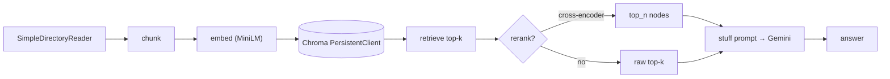

# Phase 4 — RAG fast (LlamaIndex)

Last grounded: 2026-08-23  
Prereq files: `docs/03-phase-2-tool-loop.md`, `docs/04-phase-3-state-memory.md`  
Fetch before writing:  
- https://docs.llamaindex.ai/en/stable/module_guides/supporting_modules/settings/  
- https://docs.llamaindex.ai/en/stable/understanding/rag/  
- https://docs.llamaindex.ai/en/stable/module_guides/loading/simpledirectoryreader/  
- https://docs.llamaindex.ai/en/stable/integrations/embeddings/huggingface/  
- https://docs.llamaindex.ai/en/stable/integrations/vector_stores/chromaindexdemo/  
- https://docs.llamaindex.ai/en/stable/module_guides/querying/node_postprocessors/node_postprocessors/  
- https://docs.trychroma.com/docs/overview/getting-started  
uv (new project group):

```powershell
cd agents\llamaindex
uv sync
```

First run downloads ~90 MB (MiniLM) plus a tiny cross-encoder later. One time, CPU.

Suggested file: `agents/llamaindex/04_rag_fast.py`  
Mode: **abstraction-first**. See the whole pipeline work before Phase 5 opens the hood. Default settings, no tuning beyond the one deepening (rerank).

## What

Working RAG end-to-end in one sitting: load `data/*.txt` → chunk → embed (MiniLM) → persist (Chroma) → retrieve top-k → generate (Gemini via LiteLLM) → then rerank the retrieved nodes with a local cross-encoder and watch the ordering change.

## Why

You need a mental map worth having before decomposing anything. After this phase you can point at every stage and name it. Phase 5 rebuilds each stage by hand; Phase 6 plugs this exact engine into your Phase 2 loop.

## Skeleton

RAG = **load → embed → store → retrieve → generate**.

1. Set `Settings.llm` + `Settings.embed_model` first
2. Load `data/`
3. Embed chunks and persist in Chroma
4. Retrieve top-k
5. Optional deepening: rerank
6. Stuff prompt and generate

## You already built this

This guide keeps a deliberately tight scope. What carries over, and where it comes back:

| You already own | In this guide | Comes back as a build |
|---|---|---|
| Phase 2 tool loop | **Not here.** RAG alone is one *step* inside such a loop, not the loop. | Phase 6 — this query engine becomes a tool in `run_agent` |
| Phase 3 state (`messages` + `facts`) | **Not here.** No ChatEngine, no LlamaIndex memory — that would hide the dict you wrote. | Phase 7 — LangGraph `MessagesState` |
| `max_steps` guard | Not needed yet | Phase 7 — `recursion_limit` |
| Provider swap via model string | Same habit: `LiteLLM(model=...)` | everywhere |

Rule of thumb for the rest of the course: **LlamaIndex retrieves; your loop (later LangGraph) orchestrates.**

## Official sources

- Configuring Settings: https://docs.llamaindex.ai/en/stable/module_guides/supporting_modules/settings/
- Introduction to RAG (five stages): https://docs.llamaindex.ai/en/stable/understanding/rag/
- SimpleDirectoryReader: https://docs.llamaindex.ai/en/stable/module_guides/loading/simpledirectoryreader/
- Local HuggingFace embeddings: https://docs.llamaindex.ai/en/stable/integrations/embeddings/huggingface/
- Chroma integration: https://docs.llamaindex.ai/en/stable/integrations/vector_stores/chromaindexdemo/
- Node postprocessor modules (rerankers): https://docs.llamaindex.ai/en/stable/module_guides/querying/node_postprocessors/node_postprocessors/
- Chroma persistent client: https://docs.trychroma.com/docs/overview/getting-started

## Concept

Five stages, once, in one diagram. Everything later hangs off these names.



**Rerank in one paragraph:** vector search is a *bi-encoder* — query and chunk embedded separately, ranked by cosine. Fast, but word overlap can float a chunk too high. A reranker is a *cross-encoder* — it reads `(query, chunk)` together and rescores relevance. Industry default: retrieve wide (top 5–10), keep few (top 2–3) after rerank. Here: `SentenceTransformerRerank` with `cross-encoder/ms-marco-MiniLM-L-2-v2` — local, CPU, no API key. (Cohere/Jina rerankers are hosted; `LLMRerank` burns tokens. Not used.)

---

## Segment 1 — Settings first, always

LlamaIndex silently defaults both `Settings.llm` and `Settings.embed_model` to OpenAI. If you forget, you get an opaque `OPENAI_API_KEY not set` far from the cause. Set both **at the top**, every script, before any index/query call.

```python
import os
from pathlib import Path

import chromadb
from dotenv import load_dotenv

from llama_index.core import Settings, SimpleDirectoryReader, StorageContext, VectorStoreIndex
from llama_index.embeddings.huggingface import HuggingFaceEmbedding
from llama_index.llms.litellm import LiteLLM
from llama_index.vector_stores.chroma import ChromaVectorStore

load_dotenv()

MODEL = os.environ.get("GEMINI_MODEL", "gemini/gemini-2.5-flash")

Settings.llm = LiteLLM(model=MODEL)
Settings.embed_model = HuggingFaceEmbedding(
    model_name="sentence-transformers/all-MiniLM-L6-v2",
    device="cpu",
)
```

**Expected:** imports succeed; nothing printed yet. To feel the trap once, comment the two `Settings.` lines out, run Segment 3, and read the auth error — then put them back.

Note: MiniLM truncates inputs around **256 tokens**. Sample docs below are sized for it.

## Segment 2 — Load

```python
DATA_DIR = Path(__file__).resolve().parents[2] / "data"

docs = SimpleDirectoryReader(input_dir=str(DATA_DIR)).load_data()
print(len(docs), "documents")
for d in docs[:3]:
    print("-", d.metadata.get("file_name"), len(d.text), "chars")
```

`Path(__file__)...parents[2]` lands on the repo root regardless of where you launch `uv run` from (Windows-friendly; no cwd dependence).

**Expected:** three documents (`agent-loop.txt`, `decoy-tools.txt`, `rag.txt`). If zero, the path is wrong — print `DATA_DIR`.

## Segment 3 — Persist to Chroma and query

```python
CHROMA_PATH = Path(__file__).resolve().parent / "chroma_db"

client = chromadb.PersistentClient(path=str(CHROMA_PATH))
collection = client.get_or_create_collection("course_docs")
vector_store = ChromaVectorStore(chroma_collection=collection)

index = VectorStoreIndex.from_documents(
    docs,
    storage_context=StorageContext.from_defaults(vector_store=vector_store),
)

query_engine = index.as_query_engine(similarity_top_k=5)
resp = query_engine.query("What is a tool-calling loop?")
print(resp)

for n in resp.source_nodes:
    print(round(n.score or 0, 3), n.metadata.get("file_name"), "|", n.text[:60].replace("\n", " "))
```

**Expected:** a correct sentence defining the loop, sourced mostly from `agent-loop.txt`. The score list shows what naive cosine ranked where — the decoy may or may not appear; remember the order for Segment 5. On disk now: `agents/llamaindex/chroma_db/` (gitignored).

## Segment 4 — Reload without re-embedding

Kill the script. Run again, skipping `from_documents` entirely:

```python
client = chromadb.PersistentClient(path=str(CHROMA_PATH))
collection = client.get_or_create_collection("course_docs")
index = VectorStoreIndex.from_vector_store(ChromaVectorStore(chroma_collection=collection))

print(index.as_query_engine().query("What are the stages of RAG?"))
```

**Expected:** the RAG-stages answer, near-instant, no embedding progress bar. Persistence was the point of `PersistentClient` over the in-memory default. (One client per path at a time — Chroma warns if two fight over the folder.)

## Segment 5 — Deepening: rerank

Same query, wider net, sharper cut. Retrieve top 5, rescore with the cross-encoder, keep 2.

```python
from llama_index.core.postprocessor import SentenceTransformerRerank

QUERY = "What is a tool-calling loop?"
nodes = index.as_retriever(similarity_top_k=5).retrieve(QUERY)

print("before rerank:")
for i, n in enumerate(nodes, 1):
    print(" ", i, round(n.score or 0, 3), n.metadata.get("file_name"))

reranker = SentenceTransformerRerank(
    model="cross-encoder/ms-marco-MiniLM-L-2-v2", top_n=2
)
reranked = reranker.postprocess_nodes(nodes, query_str=QUERY)

print("after rerank:")
for i, n in enumerate(reranked, 1):
    print(" ", i, round(n.score or 0, 3), n.metadata.get("file_name"))
```

And wire it into a query engine the production way:

```python
engine_reranked = index.as_query_engine(
    similarity_top_k=5,
    node_postprocessors=[
        SentenceTransformerRerank(model="cross-encoder/ms-marco-MiniLM-L-2-v2", top_n=2)
    ],
)
print(engine_reranked.query(QUERY))
```

**Expected:** `agent-loop.txt` holds rank 1 after rerank; `decoy-tools.txt` sinks or vanishes from the kept pair. Exact scores/order vary by run — the lesson is *comparing orderings*, not memorizing numbers. Postprocessors run after retrieval, before response synthesis; that slot is why "one knob" upgrades like this don't touch the rest of the pipeline.

---

## Common failures

| Symptom | Cause / fix |
|---|---|
| `OPENAI_API_KEY not set` mid-script | `Settings.llm` / `Settings.embed_model` not set before first use. Top of file, always. |
| Dimension-mismatch error on query | Old collection embedded with a different model. Delete `agents/llamaindex/chroma_db/`, rerun. |
| Slow first run | Model downloads (MiniLM ~90 MB, cross-encoder tiny). One time. |
| Chroma telemetry warnings | Harmless noise; ignore. |
| Zero documents loaded | Wrong `DATA_DIR`; print it. Files live in repo-root `data/`. |

## Engineer extras (short)

- **`similarity_top_k` lives on retriever/query engine**, not the index — widen there, not by re-indexing.
- **Scores are not probabilities.** Cosine and cross-encoder numbers aren't comparable; never mix them in one threshold.
- **Chunk defaults are fine today.** `Settings.chunk_size` / `chunk_overlap` exist; Phase 5 makes them visible by hand.

## Do not

- No ChatEngine / LlamaIndex memory / multi-turn here (that hides Phase 3).
- No wrapping the engine as a tool yet — that is all of Phase 6.
- No BM25, hybrid search, graph RAG, LlamaParse, Ollama nomic, Cohere/Jina/LLM rerank.
- No pinning by hand — the committed `uv.lock` pins everything; `uv add` when you need a new package.
- Do not write `05_rag_decomposed.py` yet.

## Suggested final file shape

`agents/llamaindex/04_rag_fast.py` — env + Settings, `DATA_DIR`/`CHROMA_PATH`, load, build-or-reload Chroma index, plain query + score printout, rerank comparison, reranked query engine, `if __name__`. Roughly 70–90 lines.

## Checkpoint

1. Why did the second run skip the embedding step?
2. What do `Settings.llm` / `Settings.embed_model` prevent?
3. Bi-encoder vs cross-encoder — what does each see?
4. Where does this query engine plug into the thing you built in Phase 2?

Answers: (1) vectors were persisted in Chroma; `from_vector_store` reuses them. (2) silent OpenAI defaults. (3) bi-encoder embeds query and chunk separately (fast, approximate); cross-encoder reads the pair jointly (accurate, slower — hence rerank-only). (4) nowhere yet — Phase 6 wraps it as a function/tool schema inside `run_agent`.
