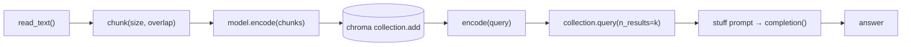

# Phase 5 — RAG decomposed (by hand)

Last grounded: 2026-08-23  
Prereq files: `docs/05-phase-4-rag-fast.md`  
Fetch before writing:  
- https://docs.trychroma.com/docs/overview/getting-started  
- https://docs.litellm.ai/docs/  
- https://docs.llamaindex.ai/en/stable/getting_started/async_python/ (gather pattern only)  
- https://docs.llamaindex.ai/en/stable/module_guides/loading/node_parsers/ (pointer: what `SentenceSplitter` does for you)  
uv (same group as Phase 4):

```powershell
cd agents\llamaindex
uv pip install -r requirements.txt
```

No new packages. `sentence-transformers` and `chromadb` are already there.

Suggested file: `agents/llamaindex/05_rag_decomposed.py`  
Mode: **decompose**. No LlamaIndex in this file. Every Phase 4 one-liner becomes a function you wrote.

## What

Rebuild the whole pipeline with your own hands: read the files, chunk on a character budget, embed chunks with MiniLM (`sentence_transformers` directly), store **your own vectors** in the raw Chroma client, embed the query, take nearest neighbors, stuff them into a prompt, and generate via LiteLLM. Then break it once (no overlap), fix it (overlap), and time embedding.

## Why

Phase 4 gave you five names and five one-liners. Until you write each stage, `index.as_query_engine()` is a spell. This is the same move as Phase 2 after Phase 0 — one internals pass, then stop. After this, every RAG framework conversation is "which stage did they tune?".

## Skeleton

Phase 4's one-liners are these functions.

1. Read files
2. Split text on a char budget
3. Embed chunks with MiniLM
4. `collection.add(ids, documents, embeddings)`
5. Embed query → `collection.query(query_embeddings=...)`
6. Stuff top-k into prompt → `completion(...)`

## You already built this

| Phase 4 call | Here it is by hand |
|---|---|
| `SimpleDirectoryReader(...).load_data()` | `Path.read_text()` |
| default `SentenceSplitter` | your `chunk(text, size, overlap)` |
| `HuggingFaceEmbedding(...)` inside the index | `SentenceTransformer.encode()` |
| `ChromaVectorStore` + `StorageContext` | `chromadb.PersistentClient` + `collection.add(embeddings=...)` |
| `as_query_engine().query(q)` | `encode(q)` + `collection.query` + stuff + `completion()` |

Not here on purpose: no agent loop (Phase 6 glues that), no rerank (done in 4).

## Official sources

- Chroma getting started (clients, add/query shapes): https://docs.trychroma.com/docs/overview/getting-started
- LiteLLM completion: https://docs.litellm.ai/docs/
- Async in Python (concurrency vs parallelism): https://docs.llamaindex.ai/en/stable/getting_started/async_python/
- What LlamaIndex's splitter does for you (compare after building yours): https://docs.llamaindex.ai/en/stable/module_guides/loading/node_parsers/

## Concept

Same five stages as Phase 4. The only change: each box is now *yours*.



Two facts worth saying once:

- **Overlap** re-includes the tail of the previous chunk at the head of the next. An idea cut by a boundary survives in at least one full chunk.
- **Cosine distance** is what Chroma returns; smaller is better. Cosine similarity ≈ `1 - distance`. Do not mix the two up when thresholding.

---

## Segment 1 — Load

```python
import os
from pathlib import Path

from dotenv import load_dotenv

load_dotenv()

MODEL = os.environ.get("GEMINI_MODEL", "gemini/gemini-2.5-flash")
DATA_DIR = Path(__file__).resolve().parents[2] / "data"

texts = {}
for p in sorted(DATA_DIR.glob("*.txt")):
    texts[p.name] = p.read_text(encoding="utf-8")

for name, body in texts.items():
    print(f"{name}: {len(body)} chars")
```

**Expected:** four files listed. If zero, print `DATA_DIR` and fix the path.

## Segment 2 — Chunk (and watch an idea get cut)

```python
def chunk(text: str, size: int = 80, overlap: int = 0) -> list[str]:
    step = size - overlap
    return [text[i : i + size] for i in range(0, len(text), step)]


for c in chunk(texts["overlap-demo.txt"], size=80, overlap=0)[:4]:
    print(repr(c[:25]), "...", repr(c[-25:]))
```

**Expected:** clean 80-char slices. Now find where the memo's fact landed: print the two chunks whose edges contain `"approved on"` / `"February"`. With no overlap, the date phrase is likely split across two chunks.

## Segment 3 — Overlap fixes it

```python
chunks_overlap = chunk(texts["overlap-demo.txt"], size=80, overlap=40)
hits = [c for c in chunks_overlap if "12 February 2024" in c]
print(len(hits), "chunk(s) contain the full date")
```

**Expected:** at least one chunk holds the whole sentence. That is the entire argument for overlap — seen, not asserted. (If size 80 already kept the date intact on your machine, drop to `size=60, overlap=30` and see it split, then heal.)

Note the tradeoff you just paid: more chunks, duplicated text, bigger index. There is no free lunch knob.

## Segment 4 — Embed and store your own vectors

```python
from sentence_transformers import SentenceTransformer
import chromadb

model = SentenceTransformer("sentence-transformers/all-MiniLM-L6-v2", device="cpu")

CHROMA_PATH = Path(__file__).resolve().parent / "chroma_db_handmade"
client = chromadb.PersistentClient(path=str(CHROMA_PATH))
collection = client.get_or_create_collection("handmade_rag")

all_chunks = []
all_ids = []
for fname, body in texts.items():
    for j, c in enumerate(chunk(body, size=80, overlap=40)):
        all_chunks.append(c)
        all_ids.append(f"{fname}::{j}")

embeddings = model.encode(all_chunks).tolist()
collection.add(ids=all_ids, documents=all_chunks, embeddings=embeddings)
print(collection.count(), "vectors stored")
```

Passing `embeddings=` explicitly is the point — Chroma's default embedder stays out of the way. `.tolist()` because numpy arrays are accepted but lists keep the shape visible.

**Expected:** a count like `40–60` (depends on file lengths). Rerun-safe tip: `get_or_create_collection` + repeated `add` duplicates rows; delete `chroma_db_handmade/` between runs while experimenting.

## Segment 5 — Retrieve and generate

```python
from litellm import completion

QUERY = "When was Project Nightjar approved?"

q_vec = model.encode([QUERY]).tolist()[0]
res = collection.query(query_embeddings=[q_vec], n_results=3)

for doc, dist in zip(res["documents"][0], res["distances"][0]):
    print(round(dist, 3), "|", doc[:50].replace("\n", " "))

context = "\n\n---\n\n".join(res["documents"][0])
resp = completion(
    model=MODEL,
    messages=[
        {"role": "system", "content": "Answer only from the notes. If they do not contain the answer, say so."},
        {"role": "user", "content": f"Notes:\n{context}\n\nQuestion: {QUERY}"},
    ],
)
print(resp.choices[0].message.content)
```

**Expected:** top hit contains the Nightjar date (distance clearly smallest); answer says **12 February 2024**. Compare with Phase 4: same stages, but you can now point at the line doing each one.

## Segment 6 — Deepening: async timing (honest version)

Embedding calls are I/O-shaped, which is why everyone reaches for `asyncio.gather`. But MiniLM runs **on CPU**, and CPU work does not yield to the event loop. See both truths yourself:

```python
import asyncio
import time


async def embed_concurrent(chunks: list[str]) -> None:
    loop = asyncio.get_running_loop()
    # offload each encode to a thread so gather has something to await
    await asyncio.gather(*(loop.run_in_executor(None, model.encode, c) for c in chunks))


def timeit(label, fn):
    t0 = time.perf_counter()
    fn()
    print(f"{label}: {time.perf_counter() - t0:.2f}s")


sample = all_chunks[:32]
timeit("sequential", lambda: [model.encode(c) for c in sample])
timeit("batched",   lambda: model.encode(sample))
asyncio.run(timeit("gather+threads", lambda: asyncio.run(embed_concurrent(sample))))
```

Typical result on CPU: **batched wins big** (one forward pass over many inputs), gather+threads barely differs from sequential (GIL + CPU-bound). Keep `asyncio.gather` in your pocket for HTTP-based embedders — the pattern transfers unchanged; only the backend changes.

Extra beat, 60 seconds: stuff **only `decoy-tools.txt`** chunks into the Segment 5 prompt and ask about Project Nightjar. You will get a fluent, confident, **wrong** answer. Retrieval quality bounds generation quality — that is groundedness.

Token-vs-character, stated once: MiniLM truncates around **256 tokens** (~roughly 1000 chars of English); Gemini counts tokens too. Char budgets are a teaching proxy, not a production unit.

---

## Common failures

| Symptom | Cause / fix |
|---|---|
| Duplicate vectors, doubled count | Re-running `add` into the same collection. Delete `chroma_db_handmade/`, rerun. |
| Answer ignores notes entirely | Context came back empty — print `res["documents"][0]`; check the collection actually has rows. |
| Fluent wrong answer | Junk or missing context stuffed in. Print the retrieved docs before blaming the model. |
| `gather` shows no speedup | Expected on CPU. It is a pattern lesson, not a magic speedup lesson. |

## Engineer extras (short)

- **Your splitter vs `SentenceSplitter`:** LlamaIndex's splits on sentence boundaries within a token budget. Yours cuts mid-word — feel why token-aware splitters exist.
- **IDs carry provenance.** `fname::j` cost nothing and makes debugging retrieval possible. Do this in real projects.
- **Distances ≠ probabilities.** Never threshold cosine distances against cross-encoder scores (Phase 4) or confidences. Different scales, different jobs.

## Do not

- No LlamaIndex imports in `05_rag_decomposed.py`.
- No reranker here — Phase 4 owns it.
- No agent loop, no tools — Phase 6.
- No BM25/hybrid/graph RAG.
- Not a milestone packet: no `## Try this`.

## Suggested final file shape

`agents/llamaindex/05_rag_decomposed.py` — env/path constants, `texts` loader, `chunk()`, model + collection setup, ingest block, retrieve-and-generate function, timing block, groundedness demo behind `if __name__`. Roughly 90–120 lines.

## Checkpoint

1. Which line replaces `VectorStoreIndex.from_documents`?
2. Why did overlap rescue the Nightjar query?
3. Chroma returns distances — is bigger better? What is similarity from it?
4. Why didn't `gather` speed up CPU embedding, and when would it?

Answers: (1) `model.encode` + `collection.add(ids, documents, embeddings)` — you are the index builder. (2) the boundary-cut date phrase existed intact in at least one overlapped chunk, so some chunk still matched. (3) smaller is better; similarity ≈ `1 - distance`. (4) CPU work never yields to the event loop (GIL + no await points inside `encode`); it pays off when each task awaits real I/O, e.g. HTTP embedding APIs — and batching beats both on local models anyway.
