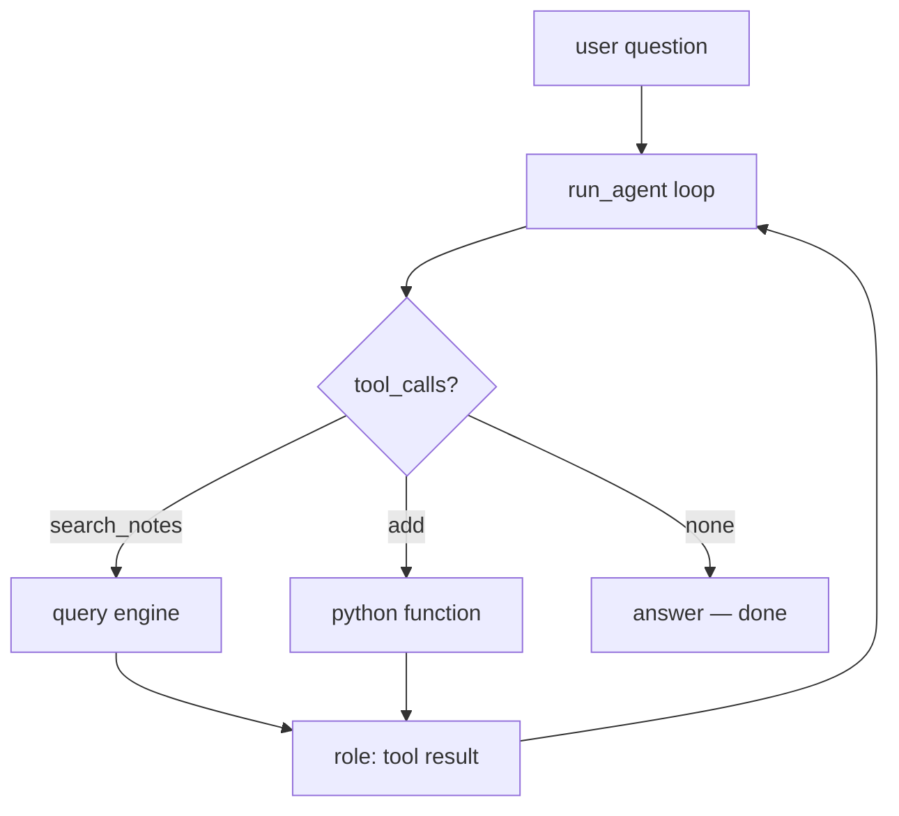

# Phase 6 — RAG as a tool (the glue)

Last grounded: 2026-08-23  
Prereq files: `docs/03-phase-2-tool-loop.md`, `docs/05-phase-4-rag-fast.md`  
Fetch before writing:  
- https://docs.litellm.ai/docs/providers/gemini  
- https://docs.llamaindex.ai/en/stable/integrations/vector_stores/chromaindexdemo/  
uv (same group as Phases 4–5):

```powershell
cd agents\llamaindex
uv sync
```

No new packages. Same `pyproject.toml`.

Suggested file: `agents/llamaindex/06_rag_as_tool.py`  
Mode: **glue**. Almost no new code — its value is two builds clicking together. Keep it short.

## What

Wrap the Phase 4 query engine as one plain function with a hand-written JSON schema, drop it into the Phase 2 loop next to `add`, and watch the model choose: retrieve from notes, do arithmetic, or just answer.

## Why

This is the payoff of the whole first half. Phase 4's maps-back table comes due: "Phase 6 — this query engine becomes a tool in `run_agent`". After this file, "RAG agent" is no longer a framework product; it is your loop plus one more entry in `TOOLS`. This is also, verbatim, the production hybrid pattern you will re-see in Phase 7 as an `@tool` inside LangGraph.

## Skeleton

RAG is a **tool**, not the agent.

1. Build the Phase 4 engine (Settings first)
2. Wrap it: `search_notes(query) -> str`
3. Hand-write its JSON schema
4. Register beside `add` in the Phase 2 loop
5. Ask something in the notes, then something that is not

## You already built this

| Piece | Origin |
|---|---|
| `run_agent(state, text)` loop | Phase 2 (`02_tool_loop.py`) |
| `state = {messages, facts}` | Phase 3 (optional here — plain dict works) |
| query engine + Chroma | Phase 4 (`04_rag_fast.py`) |
| hand-written schema + dispatch | Phase 2, Segment 2 |

Copy both halves into this file — **do not import across venvs** (`foundation` and `llamaindex` are separate projects by design).

## Official sources

- LiteLLM Gemini: https://docs.litellm.ai/docs/providers/gemini
- LlamaIndex + Chroma integration: https://docs.llamaindex.ai/en/stable/integrations/vector_stores/chromaindexdemo/

## Concept

One loop, three exits: arithmetic → `add`; notes → `search_notes`; neither → answer directly. The model decides from schemas alone.



---

## Segment 1 — Engine (from Phase 4, trimmed)

```python
import json
import os
from pathlib import Path

import chromadb
from dotenv import load_dotenv
from pydantic import BaseModel, ValidationError

from llama_index.core import Settings, VectorStoreIndex
from llama_index.embeddings.huggingface import HuggingFaceEmbedding
from llama_index.llms.litellm import LiteLLM
from llama_index.vector_stores.chroma import ChromaVectorStore

load_dotenv()

MODEL = os.environ.get("GEMINI_MODEL", "gemini/gemini-2.5-flash")

Settings.llm = LiteLLM(model=MODEL)
Settings.embed_model = HuggingFaceEmbedding(
    model_name="sentence-transformers/all-MiniLM-L6-v2", device="cpu"
)

CHROMA_PATH = Path(__file__).resolve().parent / "chroma_db"

client = chromadb.PersistentClient(path=str(CHROMA_PATH))
collection = client.get_or_create_collection("course_docs")
index = VectorStoreIndex.from_vector_store(ChromaVectorStore(chroma_collection=collection))
engine = index.as_query_engine(similarity_top_k=3)


def search_notes(query: str) -> str:
    return str(engine.query(query))
```

**Expected:** imports clean; nothing runs yet. If `chroma_db/` does not exist, run Phase 4 once to build it (or copy its build block above `from_vector_store`).

## Segment 2 — Schema by hand (30 seconds, you've done this)

```python
SEARCH_TOOL = {
    "type": "function",
    "function": {
        "name": "search_notes",
        "description": "Search the user's local notes about AI engineering topics. Use when a question might be answered by their saved documents.",
        "parameters": {
            "type": "object",
            "properties": {
                "query": {"type": "string", "description": "What to look for, phrased as a search"}
            },
            "required": ["query"],
        },
    },
}

class SearchArgs(BaseModel):
    query: str
```

The description is doing the routing. Make it say *when* to use the tool, not *what* a search engine is.

## Segment 3 — Same loop, one more branch

Bring over from `02_tool_loop.py`: `TOOLS` (now `[ADD_TOOL, SEARCH_TOOL]`), `AddArgs`, `run_add`, `MAX_STEPS`. The only new lines are in the dispatch:

```python
MAX_STEPS = 8


def run_agent(state: dict, user_text: str) -> str:
    state["messages"].append({"role": "user", "content": user_text})
    for _step in range(MAX_STEPS):
        resp = completion(model=MODEL, messages=state["messages"], tools=TOOLS)
        msg = resp.choices[0].message
        state["messages"].append(msg)
        if not msg.tool_calls:
            return msg.content or ""
        for call in msg.tool_calls:
            try:
                if call.function.name == "search_notes":
                    args = SearchArgs.model_validate_json(call.function.arguments)
                    content = search_notes(args.query)
                elif call.function.name == "add":
                    content = run_add(call.function.arguments)
                else:
                    content = f"Unknown tool: {call.function.name}"
            except ValidationError as exc:
                content = f"Invalid arguments: {exc}"
            state["messages"].append(
                {"role": "tool", "tool_call_id": call.id, "content": content}
            )
    raise RuntimeError(f"Agent exceeded max_steps={MAX_STEPS}")
```

(`completion` imported from litellm as in Phase 2.)

**Run it:**

```python
if __name__ == "__main__":
    state = {"messages": []}
    print(run_agent(state, "According to my notes, what are the stages of RAG?"))
    print(run_agent(state, "What is 41 + 1?"))
    print(run_agent(state, "Who wrote Hamlet?"))
```

**Expected:** Q1 calls `search_notes` and answers from `data/rag.txt`; Q2 calls `add` → 42; Q3 makes **no** tool call — general knowledge answered directly. Print `state["messages"]` once and find all three shapes.

That's the whole phase. If you feel like adding memory or a second retriever — stop; that is Phase 7 territory.

---

## Common failures

| Symptom | Cause / fix |
|---|---|
| Never retrieves | Description too vague ("searches stuff"). Say *what lives in the notes*. Or force once with `tool_choice="required"` to prove plumbing works, then remove. |
| Retrieves for everything, even arithmetic | Same knob, opposite end: description says "always use" — rewrite to "when a question might be answered by saved documents". |
| `ValueError` / dimension mismatch on load | Collection was built with different embeddings. Delete `chroma_db/`, rerun Phase 4 build. |
| `OPENAI_API_KEY` error | Settings lines not at top before any index/query call. |

## Engineer extras (short)

- **Tool results are strings.** `str(resp)` keeps the loop provider-agnostic — same shape whether the tool is math, HTTP, or retrieval.
- **Routing quality = description quality.** Before blaming the model, reread your schema descriptions out loud.
- **This exact seam is Phase 7.** There, the loop becomes a graph, the dispatch becomes `ToolNode`, and this same function gets wrapped with `@tool`. Nothing conceptual is added — only infrastructure.

## Do not

- No ChatEngine, no `FunctionAgent`, no LlamaIndex agent APIs.
- No LangGraph yet.
- No rerank, no new tools beyond `add`.
- No new packages.

## Try this

Put **three of your own** short `.txt` files in `data/` — real ones: class notes, a recipe, an angry rant about tabs vs spaces, anything. Don't tell the agent which file is which. Ask it something only those files know, then ask something they don't cover.

Done when it retrieves for the first, answers plainly for the second, and never treats `search_notes` as mandatory. Skip it or invent your own scenario — that is the point.

## Suggested final file shape

`agents/llamaindex/06_rag_as_tool.py` — env + Settings, engine build, `search_notes`, `SEARCH_TOOL` + `SearchArgs`, copied `add` pieces, unified `run_agent`, demo `__main__`. Roughly 100–120 lines (most of it copied from earlier phases — that is the point).

## Checkpoint

1. What did you add to Phase 2's loop to make it a RAG agent?
2. Who decides when to retrieve — your code or the model?
3. Why must the engine live in *this* venv rather than importing `agents/foundation/02_tool_loop.py`?
4. What changes in Phase 7 — the loop, the tool, or the concept?

Answers: (1) one function + one JSON schema entry in `TOOLS`. (2) the model, steered entirely by your schema descriptions. (3) isolated uv projects by design; copying keeps each group self-contained. (4) infrastructure only: graph instead of `while`, `ToolNode` instead of your dispatch, `@tool` instead of a hand-written schema — the concept is already built.
