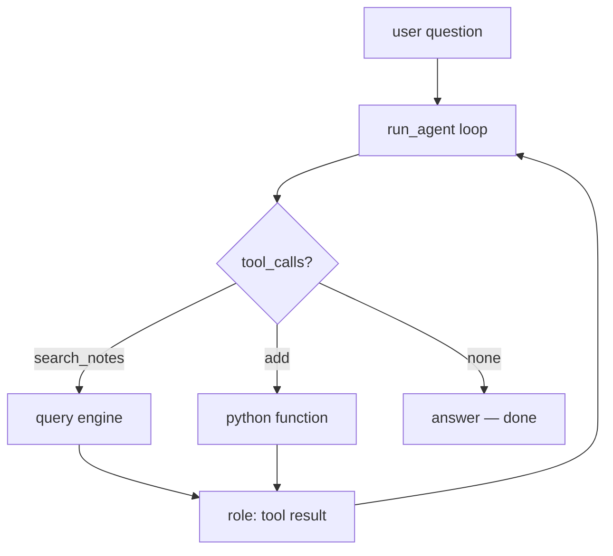

# Phase 6 — RAG as a tool (the glue)

Last grounded: 2026-08-27  
Prereq files: `docs/03-phase-2-tool-loop.md`, `docs/05-phase-4-rag-fast.md`  
Fetch before writing:  
- https://docs.litellm.ai/docs/providers/gemini  
- https://docs.llamaindex.ai/en/stable/integrations/vector_stores/chromaindexdemo/  
uv (same group as Phases 4–5):

**Windows (PowerShell):**

```powershell
if (Test-Path agents\llamaindex) { cd agents\llamaindex }
uv sync
.venv\Scripts\activate
if (-not (Test-Path 06_rag_as_tool.py)) { New-Item -ItemType File 06_rag_as_tool.py }
```

**macOS/Linux:**

```bash
[ -d agents/llamaindex ] && cd agents/llamaindex
uv sync
source .venv/bin/activate
touch 06_rag_as_tool.py
```

Open `06_rag_as_tool.py` in your IDE — you will write the segments below there. The last line creates the file only if it does not already exist, so the same block is safe to re-run.

New terminals (VS Code, Cursor) usually open at the repo root; PyCharm sometimes restores already inside the folder. That `if` / `[ -d ... ] &&` does the right thing either way.

No new packages. Same `pyproject.toml`.

Suggested file: `agents/llamaindex/06_rag_as_tool.py`  
Mode: **glue**. Almost no new code — its value is two builds clicking together. Keep it short.

## What you'll build

Wrap the Phase 4 query engine as one plain function with a hand-written JSON schema, drop it into the Phase 2 loop next to `add`, and watch the model choose: retrieve from notes, do arithmetic, or just answer.

## Why it matters

This is the payoff of the whole first half. Phase 4's maps-back table comes due: "Phase 6 — this query engine becomes a tool in `run_agent`". After this file, "RAG agent" is no longer a framework product; it is your loop plus one more entry in `TOOLS`. This is also, verbatim, the production hybrid pattern you will re-see in Phase 7 as an `@tool` inside LangGraph.

## Skeleton

RAG is a **tool**, not the agent.

1. Build the Phase 4 engine (Settings first)
2. Wrap it: `search_notes(query) -> str`
3. Hand-write its JSON schema
4. Register beside `add` in the Phase 2 loop
5. Ask something in the notes, then something that is not

## You already built this

| Piece | Origin |
|---|---|
| `run_agent(state, text)` loop | Phase 2 (`02_tool_loop.py`) |
| `state = {messages, facts}` | Phase 3 (optional here — plain dict works) |
| query engine + Chroma | Phase 4 (`04_rag_fast.py`) |
| hand-written schema + dispatch | Phase 2, Segment 2 |

Copy both halves into this file — **do not import across venvs** (`foundation` and `llamaindex` are separate projects by design).

## Official docs

- LiteLLM Gemini: https://docs.litellm.ai/docs/providers/gemini
- LlamaIndex + Chroma integration: https://docs.llamaindex.ai/en/stable/integrations/vector_stores/chromaindexdemo/

## The big picture

One loop, three exits: arithmetic → `add`; notes → `search_notes`; neither → answer directly. The model decides from schemas alone.



---

## Segment 1 — Engine (from Phase 4, trimmed)

```python
import os
from pathlib import Path

import chromadb
from dotenv import load_dotenv
from pydantic import BaseModel, ValidationError

load_dotenv()

from litellm import completion
from llama_index.core import Settings, SimpleDirectoryReader, StorageContext, VectorStoreIndex
from llama_index.embeddings.huggingface import HuggingFaceEmbedding
from llama_index.llms.litellm import LiteLLM
from llama_index.vector_stores.chroma import ChromaVectorStore

MODEL = os.getenv("GEMINI_MODEL", "gemini/gemini-3.5-flash-lite")
API_KEY = os.getenv("GEMINI_API_KEY")

Settings.llm = LiteLLM(
    model=MODEL,
    api_key=API_KEY,
)
Settings.embed_model = HuggingFaceEmbedding(
    model_name="sentence-transformers/all-MiniLM-L6-v2",
    device="cpu",
)

DATA_DIR = Path(__file__).resolve().parents[2] / "data"
CHROMA_PATH = Path(__file__).resolve().parent / "chroma_db"

client = chromadb.PersistentClient(path=str(CHROMA_PATH))
collection = client.get_or_create_collection("course_docs")
vector_store = ChromaVectorStore(chroma_collection=collection)

if collection.count() == 0:
    docs = SimpleDirectoryReader(input_dir=str(DATA_DIR)).load_data()
    index = VectorStoreIndex.from_documents(
        docs,
        storage_context=StorageContext.from_defaults(vector_store=vector_store),
    )
else:
    index = VectorStoreIndex.from_vector_store(vector_store)

engine = index.as_query_engine(similarity_top_k=3)


def search_notes(query: str) -> str:
    return str(engine.query(query))
```

**Expected:** imports clean; nothing runs yet. Empty collection → the `if` rebuilds from `data/` (same as Phase 4). Already filled → reload, no re-embed.

## Segment 2 — Schema by hand (30 seconds, you've done this)

Same job as Phase 0's docstring: the JSON `description` is what the model reads to decide *when* to retrieve. Write *when*, not a lecture on search engines.

```python
SEARCH_TOOL = {
    "type": "function",
    "function": {
        "name": "search_notes",
        "description": "Search the user's local notes about AI engineering topics. Use when a question might be answered by their saved documents.",
        "parameters": {
            "type": "object",
            "properties": {
                "query": {"type": "string", "description": "What to look for, phrased as a search"}
            },
            "required": ["query"],
        },
    },
}

class SearchArgs(BaseModel):
    query: str
```

Read that description out loud. If it does not say *when*, the model will retrieve for everything — or never.

## Segment 3 — Same loop, one more branch

Copy `add` from Phase 2, then register both tools. The only new lines in the loop are the `search_notes` branch:

```python
def add(a: float, b: float) -> float:
    return a + b


class AddArgs(BaseModel):
    a: float
    b: float


def run_add(raw_json: str) -> str:
    try:
        args = AddArgs.model_validate_json(raw_json)
    except ValidationError as exc:
        return f"Invalid arguments: {exc}"
    return str(add(args.a, args.b))


ADD_TOOL = {
    "type": "function",
    "function": {
        "name": "add",
        "description": "Add two numbers and return the sum.",
        "parameters": {
            "type": "object",
            "properties": {
                "a": {"type": "number", "description": "First addend"},
                "b": {"type": "number", "description": "Second addend"},
            },
            "required": ["a", "b"],
        },
    },
}

TOOLS = [ADD_TOOL, SEARCH_TOOL]
MAX_STEPS = 8


def run_agent(state: dict, user_text: str) -> str:
    if not state["messages"]:
        state["messages"].append(
            {
                "role": "system",
                "content": (
                    "Use search_notes for questions about the user's saved notes. "
                    "Use add for arithmetic. Answer directly otherwise."
                ),
            }
        )
    state["messages"].append({"role": "user", "content": user_text})
    for _step in range(MAX_STEPS):
        resp = completion(
            model=MODEL,
            api_key=API_KEY,
            messages=state["messages"],
            tools=TOOLS,
        )
        msg = resp.choices[0].message
        state["messages"].append(msg)
        if not msg.tool_calls:
            return msg.content or ""
        for call in msg.tool_calls:
            try:
                if call.function.name == "search_notes":
                    args = SearchArgs.model_validate_json(call.function.arguments)
                    content = search_notes(args.query)
                elif call.function.name == "add":
                    content = run_add(call.function.arguments)
                else:
                    content = f"Unknown tool: {call.function.name}"
            except ValidationError as exc:
                content = f"Invalid arguments: {exc}"
            state["messages"].append(
                {"role": "tool", "tool_call_id": call.id, "content": content}
            )
    raise RuntimeError(f"Agent exceeded max_steps={MAX_STEPS}")
```

**Run it:**

```python
if __name__ == "__main__":
    state = {"messages": []}
    print(run_agent(state, "According to my notes, what are the stages of RAG?"))
    print(run_agent(state, "What is 41 + 1?"))
    print(run_agent(state, "Who wrote Hamlet?"))
```

**Expected:** Q1 calls `search_notes` and answers from `data/rag.txt`; Q2 calls `add` → 42; Q3 makes **no** tool call — general knowledge answered directly. Print `state["messages"]` once and find all three shapes.

That's the whole phase. If you feel like adding memory or a second retriever — stop; that is Phase 7 territory.

---

## Common failures

| Symptom | Cause / fix |
|---|---|
| Never retrieves | Description too vague ("searches stuff"). Say *what lives in the notes*. Or force once with `tool_choice="required"` to prove plumbing works, then remove. |
| Retrieves for everything, even arithmetic | Same knob, opposite end: description says "always use" — rewrite to "when a question might be answered by saved documents". |
| `ValueError` / dimension mismatch on load | Collection was built with different embeddings. Delete `chroma_db/`, rerun Phase 4 build. |
| `OPENAI_API_KEY` error | Settings lines not at top before any index/query call. |

## Worth knowing

- **Tool results are strings.** `str(resp)` keeps the loop provider-agnostic — same shape whether the tool is math, HTTP, or retrieval.
- **Routing quality = description quality.** Before blaming the model, reread your schema descriptions out loud.
- **This exact seam is Phase 7.** There, the loop becomes a graph, the dispatch becomes `ToolNode`, and this same function gets wrapped with `@tool`. Nothing conceptual is added — only infrastructure.

## Don't add yet

- No ChatEngine, no `FunctionAgent`, no LlamaIndex agent APIs.
- No LangGraph yet.
- No rerank, no new tools beyond `add`.
- No new packages.

## Your finished file

`agents/llamaindex/06_rag_as_tool.py` — env + Settings, engine build (rebuild if empty), `search_notes`, `SEARCH_TOOL` + `SearchArgs`, copied `add` pieces, unified `run_agent`, demo `__main__`. Roughly 100–140 lines (most of it copied from earlier phases — that is the point).

## Checkpoint

1. What did you add to Phase 2's loop to make it a RAG agent?
2. Who decides when to retrieve — your code or the model?
3. Why must the engine live in *this* venv rather than importing `agents/foundation/02_tool_loop.py`?
4. What text steers the model toward `search_notes` instead of `add`?

Answers: (1) one function + one JSON schema entry in `TOOLS`. (2) the model, steered entirely by your schema descriptions. (3) isolated uv projects by design; copying keeps each group self-contained. (4) the `description` on `search_notes` (same job as a tool docstring).

---

## Try this

Put **three of your own** short `.txt` files in `data/` — real ones: class notes, a recipe, an angry rant about tabs vs spaces, anything. Don't tell the agent which file is which. Ask it something only those files know, then ask something they don't cover.

Done when it retrieves for the first, answers plainly for the second, and never treats `search_notes` as mandatory. Skip it or invent your own scenario — that is the point.
