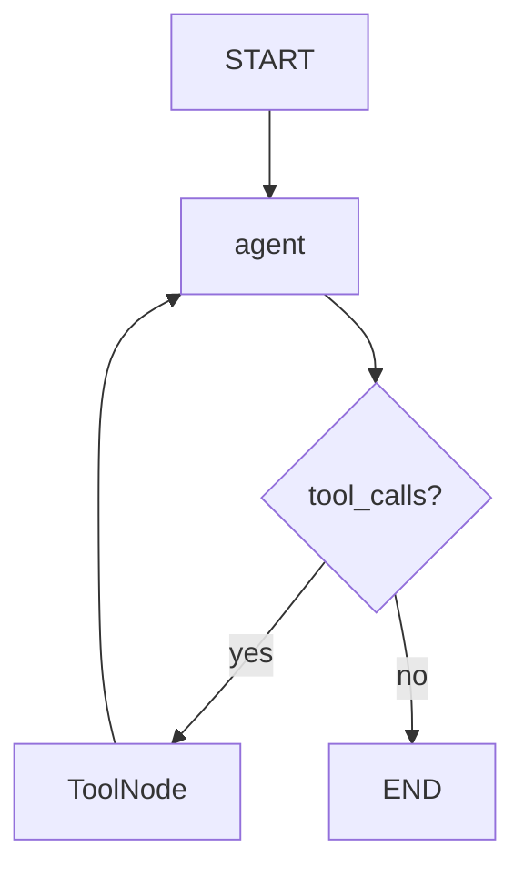

# Phase 7 — LangGraph (the loop becomes a graph)

Do first: `docs/03-phase-2-tool-loop.md`, `docs/04-phase-3-state-memory.md`, `docs/07-phase-6-rag-as-tool.md`  
uv (new project group):

**Windows (PowerShell):**

```powershell
if (Test-Path agents\langgraph) { cd agents\langgraph }
uv sync
.venv\Scripts\activate
if (-not (Test-Path 07_graph.py)) { New-Item -ItemType File 07_graph.py }
```

**macOS/Linux:**

```bash
[ -d agents/langgraph ] && cd agents/langgraph
uv sync
source .venv/bin/activate
touch 07_graph.py
```

Open `07_graph.py` in your IDE — you will write the segments below there. The last line creates the file only if it does not already exist, so the same block is safe to re-run.

New terminals (VS Code, Cursor) usually open at the repo root; PyCharm sometimes restores already inside the folder. That `if` / `[ -d ... ] &&` does the right thing either way.

First RAG run in this folder downloads MiniLM if it is not already cached (~90 MB, one time, CPU).

Suggested file: `agents/langgraph/07_graph.py`  
Mode: **abstraction-first**, then a short peek. One growing file. Graph, then tools, then the retriever, then a checkpointer, then `interrupt`. Do not wire all five in the first snippet.

## What you'll build

A `StateGraph` whose state is the message list you already know. An agent node still calls `litellm.completion`. `ToolNode` runs the Python. A checkpointer keeps a `thread_id` across process kills. `interrupt()` pauses a write until you resume it.

## Why it matters

Phase 2's loop was a `for` with `if tool_calls`. LangGraph is that loop drawn as boxes and arrows, plus two things a `for` does not give you: a snapshot after every step, and a pause that survives the process dying. After this file, "the framework" is no longer a mystery — it is your loop with names on the parts.

## Skeleton

The graph is the loop: **state in, nodes work, edges decide next**.

1. `StateGraph` + `MessagesState` (append, do not overwrite)
2. Agent node (`completion`) + `ToolNode` + `tools_condition`
3. Phase 4 engine wrapped as `@tool`
4. `SqliteSaver` + `thread_id`
5. `interrupt()` + `Command(resume=...)`

## You already built this

| Piece | Origin | Here |
|---|---|---|
| `completion(..., tools=)` | Phase 2 | the **agent** node |
| `if tool_calls` dispatch | Phase 2 | `tools_condition` |
| run the Python, append the result | Phase 2 | `ToolNode` |
| `state["messages"]` you keep | Phase 3 | `MessagesState` + `add_messages` |
| query engine as `search_notes` | Phase 6 | the same function, now `@tool` |
| `max_steps` raises | Phase 2 | `recursion_limit` (sidebar only) |

Copy the engine into this file — **do not import across venvs** (`llamaindex` and `langgraph` are separate projects by design).

## Official docs

- LangGraph overview: https://docs.langchain.com/oss/python/langgraph/overview
- Graph API (state, reducers, nodes, edges): https://docs.langchain.com/oss/python/langgraph/graph-api
- Checkpointers: https://docs.langchain.com/oss/python/langgraph/checkpointers
- Interrupts: https://docs.langchain.com/oss/python/langgraph/interrupts
- `@tool`: https://docs.langchain.com/oss/python/langchain/tools

Never `from langgraph.prebuilt import create_react_agent` — that import is deprecated. The production shortcut `from langchain.agents import create_agent` is Phase 9. You write the graph.

## The big picture

Same loop as Phase 2. The boxes are functions. The arrows are the `if`. LangGraph is the orchestration runtime: durable execution, a pause, and a snapshot — not a new kind of agent.

**State.** `MessagesState` is Phase 3's list with an append reducer — new turns extend the list, they do not replace it.

**Agent node.** Still `litellm.completion()`. The model proposes a tool call or writes a sentence.

**`ToolNode` / `tools_condition`.** Phase 2's `if tool_calls` and the Python runner, as graph parts.

**Checkpointer.** A snapshot after every step, keyed by `thread_id`, so a process kill does not wipe the thread.

**`interrupt`.** Pause before a write; resume with `Command(resume=...)`. Not `input()`.



---

## Segment 1 — A graph that only says hello

No model yet. Feel state move through one node.

```python
from langgraph.graph import END, START, MessagesState, StateGraph


def hello(state: MessagesState):
    return {"messages": [{"role": "assistant", "content": "hello from a node"}]}


builder = StateGraph(MessagesState)
builder.add_node("hello", hello)
builder.add_edge(START, "hello")
builder.add_edge("hello", END)
app = builder.compile()

result = app.invoke({"messages": [{"role": "user", "content": "hi"}]})
print(result["messages"][-1].content)
```

```powershell
uv run python 07_graph.py
```

**Expected:** `hello from a node`.

Do not `print(result)`. The object is a dict of message objects. You only need this path:

```
result["messages"]                 → the list (your Phase 3 key, with a reducer)
result["messages"][-1].content     → "hello from a node"
result["messages"][-1].type        → "ai"
```

`MessagesState` is a `TypedDict` with one key, `messages`, annotated with `add_messages`. A node returns an **update** (`{"messages": [new]}`). The reducer appends. Assigning the whole list would overwrite — that is the default reducer, the choice you already made in Phase 3 when you appended instead of replacing `state["messages"]`.

**What just moved:** `invoke` put a user message in state, `hello` appended an assistant message, `END` stopped. No `for`. The graph ran once and halted.

Keep `MessagesState`, `StateGraph`, `START`, `END`. Next segment replaces `hello`.

---

## Segment 2 — Agent node + `ToolNode`

### Decorators in 20 seconds

A decorator is a function that takes a function and returns one. `@mark` above `def greet` is the same as `greet = mark(greet)` after the def.

Run both in a scratch file — not in `07_graph.py`. You should see the same two lines either way.

**Without:**

```python
def mark(fn):
    fn.marked = True
    return fn


def greet():
    return "hi"


greet = mark(greet)
print(greet())
print(greet.marked)
```

**With:**

```python
def mark(fn):
    fn.marked = True
    return fn


@mark
def greet():
    return "hi"


print(greet())
print(greet.marked)
```

**Expected (both):**

```
hi
True
```

| Change | After the def | `@` above the def |
|---|---|---|
| What Python does | `greet = mark(greet)` | the same thing |
| What you write | two steps | one line |

`@tool` is that pattern: it keeps your function, and attaches a JSON schema the model can read. The **docstring** is the schema `description` — same job as the JSON you hand-wrote in Phase 2. A short label is enough.

Keep the Segment 1 imports. Replace the rest of the file with this. `load_dotenv()` still comes **before** importing LiteLLM.

```python
import json
import os

from dotenv import load_dotenv

load_dotenv()

from langchain.tools import tool
from langchain_core.messages import AIMessage, convert_to_openai_messages
from langchain_core.utils.function_calling import convert_to_openai_tool
from langgraph.graph import END, START, MessagesState, StateGraph
from langgraph.prebuilt import ToolNode, tools_condition
from litellm import completion

MODEL = os.getenv("GEMINI_MODEL", "gemini/gemini-3.5-flash-lite")
API_KEY = os.getenv("GEMINI_API_KEY")
SYSTEM = "Use add for arithmetic. Answer directly otherwise."


@tool
def add(a: float, b: float) -> float:
    """Add two numbers and return the sum."""
    print(f"your process ran add({a}, {b})")
    return a + b


TOOLS = [add]


def agent(state: MessagesState):
    messages = convert_to_openai_messages(state["messages"])
    if not messages or messages[0]["role"] != "system":
        messages = [{"role": "system", "content": SYSTEM}] + list(messages)
    resp = completion(
        model=MODEL,
        api_key=API_KEY,
        messages=messages,
        tools=[convert_to_openai_tool(t) for t in TOOLS],
    )
    msg = resp.choices[0].message
    if not msg.tool_calls:
        return {"messages": [AIMessage(content=msg.content or "")]}
    tool_calls = []
    for call in msg.tool_calls:
        tool_calls.append(
            {
                "id": call.id,
                "name": call.function.name,
                "args": json.loads(call.function.arguments),
            }
        )
    return {"messages": [AIMessage(content=msg.content or "", tool_calls=tool_calls)]}


builder = StateGraph(MessagesState)
builder.add_node("agent", agent)
builder.add_node("tools", ToolNode(TOOLS))
builder.add_edge(START, "agent")
builder.add_conditional_edges("agent", tools_condition)
builder.add_edge("tools", "agent")
app = builder.compile()

result = app.invoke({"messages": [{"role": "user", "content": "What is 41 + 1?"}]})
print(result["messages"][-1].content)
```

The node **must** be named `"tools"`. `tools_condition` returns `"tools"` or `"__end__"` — those strings are the next node.

**Expected:** `your process ran add(41.0, 1.0)` then a sentence containing 42.

Do not dump `result["messages"]`. The three shapes are:

```
assistant tool_calls   → AIMessage.tool_calls[0]["name"] == "add"
tool result            → ToolMessage.content == "42.0"
final answer           → last AIMessage.content  (no tool_calls)
```

`convert_to_openai_tool(add)` is the JSON you used to paste by hand. `convert_to_openai_messages` turns LangGraph's message objects into the dicts `completion()` already knows.

Read, do not paste — `tools_condition` is this:

```python
def tools_condition(state):
    last = state["messages"][-1]
    if getattr(last, "tool_calls", None):
        return "tools"
    return END
```

That is Phase 2's `if not msg.tool_calls`. `ToolNode` is the `for call in msg.tool_calls` plus `role: "tool"`.

**What just moved:**

1. `agent` called `completion` (Phase 2's model step).
2. `tools_condition` looked at `tool_calls` (Phase 2's `if`).
3. `ToolNode` ran `add` and appended the result (Phase 2's dispatch).
4. The edge back to `agent` is the loop.

Keep `MODEL`, `API_KEY`, `SYSTEM`, `add`, `TOOLS`, `agent`, and the builder. Next: one more tool.

---

## Segment 3 — `search_notes` (`@tool`)

Isolated venv: paste the Phase 4 engine in full. Do not import `agents/llamaindex/04_rag_fast.py`.

Keep Segment 2. Add these imports at the top (after `load_dotenv()`, with the other third-party imports):

```python
from pathlib import Path

import chromadb
from llama_index.core import Settings, SimpleDirectoryReader, StorageContext, VectorStoreIndex
from llama_index.embeddings.huggingface import HuggingFaceEmbedding
from llama_index.llms.litellm import LiteLLM
from llama_index.vector_stores.chroma import ChromaVectorStore
```

Right after `API_KEY`, set Settings **before** any index call, then build the engine. Empty collection → embed. Already filled → reload.

```python
Settings.llm = LiteLLM(
    model=MODEL,
    api_key=API_KEY,
)
Settings.embed_model = HuggingFaceEmbedding(
    model_name="sentence-transformers/all-MiniLM-L6-v2",
    device="cpu",
)

DATA_DIR = Path(__file__).resolve().parents[2] / "data"
CHROMA_PATH = Path(__file__).resolve().parent / "chroma_db"

client = chromadb.PersistentClient(path=str(CHROMA_PATH))
collection = client.get_or_create_collection("course_docs")
vector_store = ChromaVectorStore(chroma_collection=collection)

if collection.count() == 0:
    docs = SimpleDirectoryReader(input_dir=str(DATA_DIR)).load_data()
    index = VectorStoreIndex.from_documents(
        docs,
        storage_context=StorageContext.from_defaults(vector_store=vector_store),
    )
else:
    index = VectorStoreIndex.from_vector_store(vector_store)

engine = index.as_query_engine(similarity_top_k=3)
```

`CHROMA_PATH` lives in *this* folder (`agents/langgraph/chroma_db/`), not the LlamaIndex one. First run in this venv rebuilds.

Replace `SYSTEM` and add `search_notes` next to `add`. Replace the `TOOLS` line. Replace the `invoke` at the bottom with the three questions.

```python
SYSTEM = (
    "Use search_notes for questions about the user's saved notes. "
    "Use add for arithmetic. Answer directly otherwise."
)


@tool
def search_notes(query: str) -> str:
    """Search the user's local notes about AI engineering topics. Use when a question might be answered by their saved documents."""
    print(f"your process ran search_notes({query!r})")
    return str(engine.query(query))


TOOLS = [add, search_notes]
```

```python
if __name__ == "__main__":
    print(app.invoke({"messages": [{"role": "user", "content": "According to my notes, what are the stages of RAG?"}]})["messages"][-1].content)
    print(app.invoke({"messages": [{"role": "user", "content": "What is 41 + 1?"}]})["messages"][-1].content)
    print(app.invoke({"messages": [{"role": "user", "content": "Who wrote Hamlet?"}]})["messages"][-1].content)
```

**Expected:** Q1 prints `your process ran search_notes(...)` and answers from `data/rag.txt`; Q2 prints `your process ran add(...)` then 42; Q3 makes **no** tool call. First run in this folder may show a MiniLM download / embed progress bar.

**What just moved:** the Phase 4 engine is one more `@tool` on `TOOLS`. `ToolNode(TOOLS)` picks it up because you re-run the whole file. You did not hard-code retrieve vs add vs answer.

Keep Settings, `engine`, `search_notes`, `TOOLS`, `agent`, the builder. Next: the graph remembers after you kill it.

---

## Segment 4 — `SqliteSaver` + `thread_id`

Without a checkpointer, `invoke` is one shot — like Phase 2's `run_agent` throwing the list away. Compile with a saver and pass the same `thread_id` to continue a conversation.

Keep everything above `builder =`. Add:

```python
import sqlite3

from langgraph.checkpoint.sqlite import SqliteSaver
```

Replace the `compile` line and `__main__`:

```python
DB_PATH = Path(__file__).resolve().parent / "checkpoints.db"
conn = sqlite3.connect(str(DB_PATH), check_same_thread=False)
checkpointer = SqliteSaver(conn)
app = builder.compile(checkpointer=checkpointer)

if __name__ == "__main__":
    config = {"configurable": {"thread_id": "demo"}}
    turn1 = app.invoke(
        {"messages": [{"role": "user", "content": "My name is Ada."}]},
        config,
    )
    print(turn1["messages"][-1].content)
```

Run once. **Expected:** a greeting that may mention Ada.

Do not print `turn1`. The new path is:

```
config["configurable"]["thread_id"]   → "demo"  (the pointer into the db)
DB_PATH                               → agents/langgraph/checkpoints.db  (gitignored)
```

Now change **only** the user string to `"What is my name?"` and run again. Same `thread_id`. **Expected:** Ada. Kill the terminal, run that second question once more. Still Ada. The process died; the sqlite file did not.

Contrast once: swap `SqliteSaver(conn)` for `InMemorySaver()` (`from langgraph.checkpoint.memory import InMemorySaver`). Run the name turn, kill, ask the name. Forgotten. Put `SqliteSaver` back — that is the finished checkpointer.

Stale name in blog posts: `MemorySaver`. The pin uses `InMemorySaver`.

**What just moved:** each super-step wrote a snapshot keyed by `thread_id`. The second `invoke` loaded it and appended. Phase 3's list you held in RAM is now a file.

Keep `conn`, `checkpointer`, `app = builder.compile(checkpointer=checkpointer)`, and `config`. Next: pause a write.

---

## Segment 5 — `interrupt()` + `Command(resume=...)`

A checkpointer lets the graph wait. `interrupt(value)` pauses the **node**, surfaces `value`, and waits. You resume with `Command(resume=...)`. That resume value becomes the return of `interrupt()`.

Never `input()`. Never wrap `interrupt()` in bare `try/except` — it pauses by raising, and a bare `except` swallows the pause.

The node restarts from the **top** on resume. Anything before `interrupt()` runs again. Put side effects **after** the pause, or make them idempotent.

Keep `search_notes` and `add`. Add the import and the tool. Replace `SYSTEM` and `TOOLS`. Replace `__main__`.

```python
from langgraph.types import Command, interrupt
```

```python
SYSTEM = (
    "Use search_notes for questions about the user's saved notes. "
    "Use add for arithmetic. Use write_note only when asked to save a note. "
    "Answer directly otherwise."
)


@tool
def write_note(text: str) -> str:
    """Write a short note to disk after a human approves. Use only when asked to save a note."""
    approved = interrupt(
        {
            "action": "write_note",
            "text": text,
            "question": "Approve writing this note?",
        }
    )
    if not approved:
        return "Write cancelled."
    path = Path(__file__).resolve().parent / "approved-note.txt"
    path.write_text(text, encoding="utf-8")
    print(f"your process ran write_note({text!r})")
    return f"Wrote {path.name}"


TOOLS = [add, search_notes, write_note]
```

```python
if __name__ == "__main__":
    config = {"configurable": {"thread_id": "hitl"}}
    paused = app.invoke(
        {
            "messages": [
                {
                    "role": "user",
                    "content": "Write a note that says hello from phase 7",
                }
            ]
        },
        config,
    )
    print(paused["__interrupt__"][0].value)
```

**Expected:** no `your process ran write_note`. No `approved-note.txt` yet. The print is the payload:

```
paused["__interrupt__"][0].value          → the dict you passed to interrupt()
paused["__interrupt__"][0].value["text"]  → the pending note
```

Same `thread_id`, resume **no**:

```python
    denied = app.invoke(Command(resume=False), config)
    print(denied["messages"][-1].content)
```

**Expected:** a cancellation sentence. Still no file. Still no process print.

Change `resume=False` to `resume=True`, use a **new** `thread_id` (the last one already finished), run the pause + resume again.

**Expected:** `your process ran write_note(...)` and `agents/langgraph/approved-note.txt` contains the sentence.

**What just moved:** `ToolNode` started `write_note`, `interrupt` saved state and stopped. `Command(resume=True)` restarted that node from the top, `interrupt()` returned `True`, then the write ran once.

Streaming (`app.stream` / `stream_events`) can show the same pause as tokens. You do not need it today — `invoke` already returns `__interrupt__`. Leave streaming for later.

---

## Common failures

| Symptom | Cause / fix |
|---|---|
| `tools_condition` goes nowhere / missing node `"tools"` | The `ToolNode` must be added as `"tools"`. That string is what `tools_condition` returns. |
| `OPENAI_API_KEY` mid-script | Settings lines missing or below the first index call. Top of file, always. |
| Graph never pauses | No checkpointer, or you wrapped `interrupt()` in `except Exception`. |
| Note written twice | Side effect sat *above* `interrupt()`. On resume the node starts over. Move the write below. |
| Second turn forgets Ada | Different `thread_id`, or still on `InMemorySaver` after a process kill. |
| `create_react_agent` ImportError / deprecation | Wrong import. You are writing `StateGraph` in this phase. |
| Harmless checkpoint deprecation warning on import | Pin noise. Ignore it. |

## Worth knowing

- **`recursion_limit`** is Phase 2's `max_steps` as a graph-wide cap (default is large). Pass it in the config dict next to `configurable`, not inside it: `{"recursion_limit": 8, "configurable": {"thread_id": "demo"}}`.
- **`InMemorySaver` vs `SqliteSaver`.** RAM vs a file. Same `thread_id` API. Production often uses Postgres; the interface does not change.
- **Streaming is a sidebar.** Official tutorials lead with `stream_events`. `invoke` is enough to see state, tool prints, and `__interrupt__`.
- **`create_agent`.** One-line ReAct harness on top of this graph. Phase 9. Not this file.

## Don't add yet

- No `create_react_agent`, no `create_agent`.
- No subgraphs, no Store (cross-thread memory), no document-grade-and-rewrite RAG loop.
- No LangSmith, MCP, Deep Agents.
- No `input()` for HITL.
- Do not write `07b_multi_agent.py` yet.

## Your finished file

`agents/langgraph/07_graph.py` — env + Settings, engine build (rebuild if empty), `add` / `search_notes` / `write_note`, `agent` via `completion`, `ToolNode` + `tools_condition`, `SqliteSaver`, interrupt demo in `__main__`. Roughly 140–180 lines.

## Checkpoint

1. What in this file is Phase 2's `if tool_calls`?
2. Who appends the tool result — your `for` loop or `ToolNode`?
3. Why does a second process still know Ada with `SqliteSaver` and not with `InMemorySaver`?
4. Why must `interrupt()` not sit inside `except Exception`?
5. Where must `path.write_text` live relative to `interrupt()`, and why?

Answers: (1) `tools_condition`. (2) `ToolNode`. (3) sqlite wrote the snapshot to disk; RAM died with the process. (4) `interrupt` pauses by raising; a bare `except` swallows the pause. (5) after the pause — the node restarts from the top, so a write above `interrupt` would run again.

---

## Try this

You have a tool that writes one sentence into `data/approved-note.txt`. Do not let it write until a human says yes.

Keep `search_notes`. Point `write_note` at `data/approved-note.txt` (or keep the langgraph-folder path). Ask the graph to save one fact from your notes. Resume once with `False` (file stays missing), once with `True` (file appears).

Done when the file is created only after `Command(resume=True)`, never from the first `invoke`. Skip it or invent your own.
