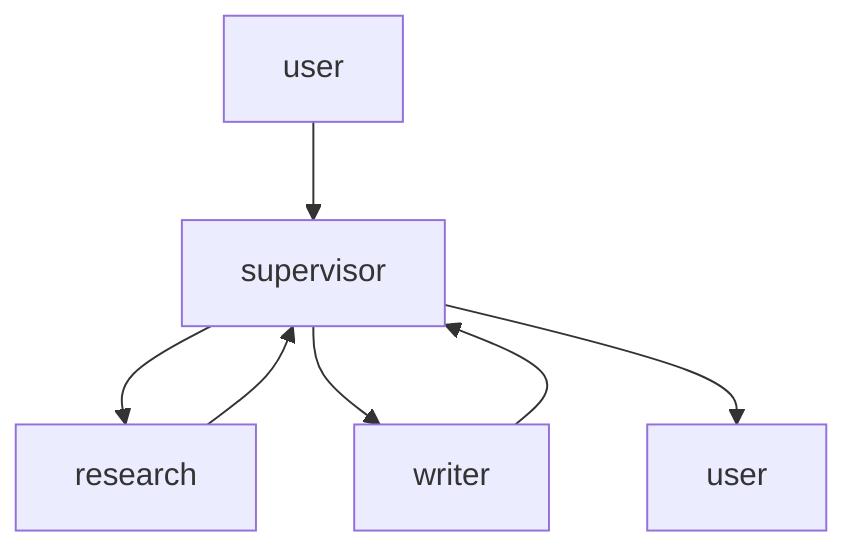

# Phase 7b — Multi-agent (supervisor, then a handoff contrast)

Do first: `docs/08-phase-7-langgraph.md`  
uv (same group as Phase 7):

**Windows (PowerShell):**

```powershell
if (Test-Path agents\langgraph) { cd agents\langgraph }
uv sync
.venv\Scripts\activate
if (-not (Test-Path 07b_multi_agent.py)) { New-Item -ItemType File 07b_multi_agent.py }
```

**macOS/Linux:**

```bash
[ -d agents/langgraph ] && cd agents/langgraph
uv sync
source .venv/bin/activate
touch 07b_multi_agent.py
```

Open `07b_multi_agent.py` in your IDE — you will write the segments below there. The last line creates the file only if it does not already exist, so the same block is safe to re-run.

New terminals (VS Code, Cursor) usually open at the repo root; PyCharm sometimes restores already inside the folder. That `if` / `[ -d ... ] &&` does the right thing either way.

No new packages. Same `pyproject.toml`.

Suggested file: `agents/langgraph/07b_multi_agent.py`  
Mode: **abstraction**. After a working single-agent graph, not earlier. Copy the Phase 7 loop into this file — do not import `07_graph.py`. Two specialists as tools. One deepening (handoff as contrast, not a build).

## What you'll build

The Phase 7 graph again, but the tools are other agents: `research` looks up notes, `writer` returns markdown and has no tools of its own. One user line needs both. The supervisor decides.

## Why it matters

"Multi-agent" is not a new runtime. It is one agent whose tools happen to be other agents. If you can wrap `search_notes` as `@tool`, you can wrap a specialist the same way. Everything else in this phase is a different wiring of that idea.

## Skeleton

A supervisor is **one agent whose tools are other agents**.

1. Copy the Phase 7 graph (agent → tools → agent)
2. `research` = RAG from 6/7
3. `writer` = no tools, markdown out
4. One task that needs both
5. Handoff as contrast (`Command.goto`) — read, do not paste as the build

## You already built this

| Piece | Origin |
|---|---|
| `agent` + `ToolNode` + `tools_condition` | Phase 7 |
| `search_notes` / the Phase 4 engine | Phases 4 and 6 |
| Schema `description` steers the model | Phases 2 and 6 |

## Official docs

- Multi-agent patterns: https://docs.langchain.com/oss/python/langchain/multi-agent
- Subagents (supervisor calls specialists as tools): https://docs.langchain.com/oss/python/langchain/multi-agent/subagents
- Handoffs (contrast only): https://docs.langchain.com/oss/python/langchain/multi-agent/handoffs
- LlamaIndex multi-agent (pointer): https://docs.llamaindex.ai/en/stable/understanding/agent/multi_agent/

Not in this file: router, Skills, A2A, Deep Agents, `create_agent`, `create_react_agent`.

## The big picture

Results flow back through the supervisor. Specialists do not talk to you.

**Supervisor.** The same agent node as Phase 7. Its tools happen to be other agents.

**`research`.** RAG wrapped as a tool. It returns notes, not a user-facing answer.

**`writer`.** No tools of its own. It shapes markdown. The supervisor never sees its inner messages — only the string it returns.

**Handoff (contrast).** A different wiring: the specialist becomes the next speaker (`Command.goto`). Read, do not paste as the build.



---

## Segment 1 — Supervisor graph (copy, then rename the tools)

Paste the Phase 7 engine + `agent` node + builder into this file. Isolated venv: copy, do not import.

```python
import json
import os
from pathlib import Path

import chromadb
from dotenv import load_dotenv

load_dotenv()

from langchain.tools import tool
from langchain_core.messages import AIMessage, convert_to_openai_messages
from langchain_core.utils.function_calling import convert_to_openai_tool
from langgraph.graph import END, START, MessagesState, StateGraph
from langgraph.prebuilt import ToolNode, tools_condition
from litellm import completion
from llama_index.core import Settings, SimpleDirectoryReader, StorageContext, VectorStoreIndex
from llama_index.embeddings.huggingface import HuggingFaceEmbedding
from llama_index.llms.litellm import LiteLLM
from llama_index.vector_stores.chroma import ChromaVectorStore

MODEL = os.getenv("GEMINI_MODEL", "gemini/gemini-3.5-flash-lite")
API_KEY = os.getenv("GEMINI_API_KEY")
SYSTEM = (
    "You are a supervisor. Use research for facts from the user's saved notes. "
    "Use writer to turn findings into markdown. When asked for a brief, use both. "
    "Do not write the markdown yourself."
)

Settings.llm = LiteLLM(
    model=MODEL,
    api_key=API_KEY,
)
Settings.embed_model = HuggingFaceEmbedding(
    model_name="sentence-transformers/all-MiniLM-L6-v2",
    device="cpu",
)

DATA_DIR = Path(__file__).resolve().parents[2] / "data"
CHROMA_PATH = Path(__file__).resolve().parent / "chroma_db"

client = chromadb.PersistentClient(path=str(CHROMA_PATH))
collection = client.get_or_create_collection("course_docs")
vector_store = ChromaVectorStore(chroma_collection=collection)

if collection.count() == 0:
    docs = SimpleDirectoryReader(input_dir=str(DATA_DIR)).load_data()
    index = VectorStoreIndex.from_documents(
        docs,
        storage_context=StorageContext.from_defaults(vector_store=vector_store),
    )
else:
    index = VectorStoreIndex.from_vector_store(vector_store)

engine = index.as_query_engine(similarity_top_k=3)


def agent(state: MessagesState):
    messages = convert_to_openai_messages(state["messages"])
    if not messages or messages[0]["role"] != "system":
        messages = [{"role": "system", "content": SYSTEM}] + list(messages)
    resp = completion(
        model=MODEL,
        api_key=API_KEY,
        messages=messages,
        tools=[convert_to_openai_tool(t) for t in TOOLS],
    )
    msg = resp.choices[0].message
    if not msg.tool_calls:
        return {"messages": [AIMessage(content=msg.content or "")]}
    tool_calls = []
    for call in msg.tool_calls:
        tool_calls.append(
            {
                "id": call.id,
                "name": call.function.name,
                "args": json.loads(call.function.arguments),
            }
        )
    return {"messages": [AIMessage(content=msg.content or "", tool_calls=tool_calls)]}
```

**Expected:** imports clean; `TOOLS` is not defined yet, so do not run. Same `chroma_db/` as Phase 7 if you already built it.

Keep Settings, `engine`, `SYSTEM`, `agent`. Next: the two specialists.

---

## Segment 2 — `research` and `writer`

`research` is Phase 6's `search_notes` with a specialist's name. `writer` calls `completion` with **no** tools — it only shapes markdown. The supervisor never sees `writer`'s inner messages; it sees the string `writer` returns.

The docstring is still a short label so the supervisor knows *when* to call each one.

```python
@tool
def research(query: str) -> str:
    """Search the user's local notes about AI engineering topics. Use when a brief needs facts from saved documents."""
    print(f"your process ran research({query!r})")
    return str(engine.query(query))


@tool
def writer(notes: str) -> str:
    """Turn research notes into a short markdown brief. Pass the notes in; do not invent facts."""
    print(f"your process ran writer({notes[:40]!r}...)")
    resp = completion(
        model=MODEL,
        api_key=API_KEY,
        messages=[
            {
                "role": "system",
                "content": "Write a short markdown brief from the notes. No extra commentary.",
            },
            {"role": "user", "content": notes},
        ],
    )
    return resp.choices[0].message.content or ""


TOOLS = [research, writer]
```

Wire the same graph as Phase 7. `ToolNode` still must be named `"tools"`.

```python
builder = StateGraph(MessagesState)
builder.add_node("agent", agent)
builder.add_node("tools", ToolNode(TOOLS))
builder.add_edge(START, "agent")
builder.add_conditional_edges("agent", tools_condition)
builder.add_edge("tools", "agent")
app = builder.compile()

if __name__ == "__main__":
    result = app.invoke(
        {
            "messages": [
                {
                    "role": "user",
                    "content": "Write a short markdown brief on the stages of RAG from my notes.",
                }
            ]
        }
    )
    print(result["messages"][-1].content)
```

**Expected:** `your process ran research(...)` then `your process ran writer(...)` then markdown (headings, short paragraphs) about RAG stages. If `writer` never runs, tighten `SYSTEM` — the supervisor must not write the brief itself.

Do not dump `result["messages"]`. The path you care about:

```
research ran          → process print, then a ToolMessage with retrieved text
writer ran            → process print, then a ToolMessage with markdown
final AIMessage       → the supervisor's last sentence (often just the markdown, or a one-liner around it)
```

**What just moved:** two specialists are tools. The Phase 7 graph did not change. The supervisor chose both because the user line needed facts *and* a brief.

Keep `research`, `writer`, `TOOLS`, `app`. That is the build.

---

## Segment 3 — Handoff as contrast (read, do not paste)

Supervisor-as-tools is the pattern you just ran: control always returns to the supervisor.

The other common wiring is a **handoff**: a specialist becomes the active node and talks until it transfers away. LangGraph does that with `Command(goto=...)` from a tool or node — not with a second framework.

Read, do not paste:

```python
from langgraph.types import Command


def transfer_to_writer():
    return Command(goto="writer")
```

That `goto` is an edge you would add instead of always returning to `agent`. You would also split `research` / `writer` into **nodes**, not tools. Different drawing, same functions.

LlamaIndex's built-in version of handoff is `AgentWorkflow` with `can_handoff_to=["WriteAgent"]` on a `FunctionAgent`. Pointer only — you already met `FunctionAgent` in Phase 0; do not add `AgentWorkflow` here.

Not today: a router (one classify step, no ongoing supervisor), Skills, A2A, Deep Agents.

**What just moved:** nothing in your file. You now have a name for the wiring you *did not* choose.

---

## Common failures

| Symptom | Cause / fix |
|---|---|
| Only `research` runs | `SYSTEM` lets the supervisor write the brief. Repeat: "Do not write the markdown yourself." |
| `writer` invents stages | It did not receive the notes. Make the supervisor pass `research`'s output into `writer`. |
| `OPENAI_API_KEY` | Settings not at the top before the engine. |
| Wanted to `import` Phase 7 | Isolated projects. Copy is the lesson. |

## Worth knowing

- **Context isolation.** Each specialist sees the string you passed, not the full supervisor transcript (unless you pass it). That is the point of wrapping them as tools.
- **Names and descriptions route.** Same knob as Phase 6. If the supervisor picks wrong, reread the docstrings out loud.
- **Checkpointer optional here.** Phase 7 already proved `thread_id`. Skip it unless you want a multi-turn supervisor.

## Don't add yet

- No router, Skills, A2A, Deep Agents.
- No `create_agent` / `create_react_agent`.
- No LlamaIndex `AgentWorkflow` as a build.
- No `Command.goto` in the finished file — contrast only.
- Do not write Phase 8 or 9 yet.

## Your finished file

`agents/langgraph/07b_multi_agent.py` — env + Settings, engine, `research`, `writer`, copied `agent` + `ToolNode` graph, one demo invoke. Roughly 120–150 lines (most of it copied). Segment 3 is reading, not more code.

## Checkpoint

1. What did you add to the Phase 7 graph to make it multi-agent?
2. Who talks to the user — `research`, `writer`, or the supervisor?
3. Why copy the engine into this file instead of importing `07_graph.py`?
4. In one sentence, how is a handoff different from what you built?

Answers: (1) two specialist `@tool`s on `TOOLS` (the graph wiring stayed). (2) the supervisor. (3) isolated uv projects; copying keeps this folder self-contained. (4) a handoff *transfers* control to a specialist node; a supervisor *calls* a specialist and takes the result back.

---

## Try this

You want a one-pager on something you actually care about — a hobby, a bug from this week, a recipe — and the facts live in files you already have (or three new short `.txt` files in `data/`).

Keep the supervisor. Point `research` at those files. Ask for a markdown brief that needs both lookup and writing. Do not hard-code which specialist runs.

Done when research ran, writer ran, you got markdown, and you never called either specialist yourself in Python. Skip it or invent your own.
